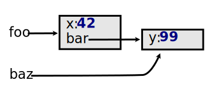
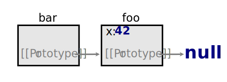
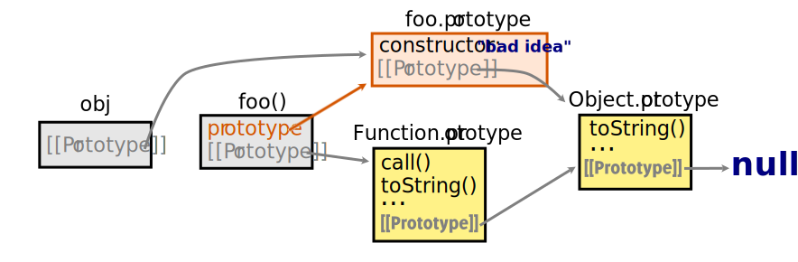

## Introduction

For a few years now JavaScript has been rapidly gaining popularity, and this trend shows no sign of abating. In addition to client-side web app development, it is now used for creating [desktop](https://electronjs.org/) and [mobile](https://facebook.github.io/react-native/) apps, as a [server-side language](https://nodejs.org/en/) and even [embedded](https://www.espruino.com/). This means an influx of new developers, many of which already have a "main" language, like Java, C++ or PHP - in these, and many other popular programming languages, code is mostly organized as classes and while JavaScript also supports the class-based object-oriented paradigm, it can leave one with a kind of "uncanny valley" feeling because even though things look very similar on the surface, JavaScript classes are just different in ways that can be difficult to truly grok without digging deeper.

So this article aims to be a self-contained resource providing a complete explanation of classes, accessible to programmers with limited (or completely lacking) JavaScript experience that can be read in a single sitting. OK, maybe two. Most of the language prerequisites are covered in [Part Ⅰ](#part1), the rest being introduced along the way. The focus here is on classes, so other language aspects are covered to the extent that they are relevant; some topics (mainly async, scope and closures) are not covered at all. For a thorough treatment of the whole JavaScript language, I found Kyle Simpson's ["You Don't Know JS" series of books](https://www.amazon.com/gp/product/B07FK9VBD7) an excellent resource - it is freely available on GitHub and I link to it's contents throughout this article.

There are no exercises - concepts are illustrated via prose, code snippets, comments and diagrams - these should provide enough material to enable readers to devise their own experiments. 
Trying out JavaScript code is incredibly easy, because most devices have a state-of-the art development environment already installed - the browser dev tools; there is a section covering basic usage.

## Content Overview

[Part Ⅰ]() comprizes a brief history of JavaScript and an introduction to some basic concepts - feel free to pick and choose what to read, or skip it entirely; [Part Ⅱ]() discusses how objects become connected between them via prototype links, and [Part Ⅲ]() applies this knowledge for implementing rudimentary, "prototypal" classes and inheritance. In [Part Ⅳ](), we convert the improvised classes to "real" classes by using the <abbr title="ECMAScript">ES</abbr>6-introduced `class` keyword - and explore the differences. Finally, in [Part Ⅴ]() we re-implement the same functionality, this time following the prototypal, "classless", or <abbr title="Objects Linked to Other Objects">OLOO</abbr> approach.

## Part Ⅰ - JavaScript Primer

### Brief History and Current State

The initial version of JavaScript was [designed and implemented by one man in 10 days](https://thenewstack.io/brendan-eich-on-creating-javascript-in-10-days-and-what-hed-do-differently-today/) for the Netscape browser, enabling previously unseen levels of interactivity - which proved popular and determined other browsers to support it as well. But the language had no official specification and browser vendors [were not on good terms](https://en.wikipedia.org/wiki/Browser_wars#First_Browser_War_(1995%E2%80%932001)) - which lead to diverging implementations. Netscape reached out to [Ecma International](https://en.wikipedia.org/wiki/Ecma_International), a standards body, and in 1997 the language was formalized in the ECMA-262 standard with the vendor-neutral name "ECMAScript". Incremental improvements followed, marred by constant bickering among browser vendors.

The 5th iteration of the standard (know as [<abbr title="ECMAScript">ES</abbr>5](https://www.ecma-international.org/publications/files/ECMA-ST-ARCH/ECMA-262%205th%20edition%20December%202009.pdf)) represented an important milestone; released in 2009, it reconciled and codified differences between browser implementations, clarified ambiguities and added a raft of new features; a minor update was released in 2011, [<abbr title="ECMAScript">ES</abbr>5.1](http://ecma-international.org/ecma-262/5.1/) which clarified some aspects but didn't introduce any functional changes. Generally, when people talk about ES5 they actually mean ES5.1.

The next major release followed in 2015, known as [<abbr title="ECMAScript">ES</abbr>6]() or ES2015. Like ES5, it introduced [many new features](http://es6-features.org); among them, the `class` keyword, which provided language-level support for class-based programming. Virtually all ES6 features [are now supported](https://kangax.github.io/compat-table/es6/) by all major browsers, with [tail call optimization](https://2ality.com/2015/06/tail-call-optimization.html) being the most notable exception.  ES2015 also inaugurated the practice of yearly releases; since then, ES2016, ES2017, ES2018 and ES2019 were released, containing mostly [incremental improvements](https://kangax.github.io/compat-table/es2016plus/) - nothing on the scale of ES5 or ES6.

The ECMA-262 standard is continuously evolving, steered by Ecma International's [TC39](https://www.ecma-international.org/memento/tc39-rf-tg.htm) committee. TC39 members can [propose changes](https://github.com/tc39/how-we-work/blob/master/champion.md) to the language, and each proposal goes through [five zero-indexed stages](https://tc39.es/process-document/); the last stage, 4, is "Finished" and denotes a feature that will be included in the next official release of the standard. Releases are normally "cut" every year around July with the most recent one being [ES2019](https://www.ecma-international.org/ecma-262/10.0/) and that's the version we'll be using in this article.

It is common practice to write JavaScript code using non-"Finished" features (which generally lack widespread browser support) as they provide a more ergonomic developer experience - but re-compile to a more conservative version of the language before deploying to production. This re-compilation process is also known as ["transpilation"](https://scotch.io/tutorials/javascript-transpilers-what-they-are-why-we-need-them) and one of the most common tools used for this purpose is [Babel](https://babeljs.io/).

You can get a good idea of what's coming in ES2020 by viewing all proposals that are currently "Finished" on [TC39s github account](https://github.com/tc39/proposals/blob/master/finished-proposals.md). Because one of the requirements for a proposal to reach stage 4 is that at least two conforming implementations exist, most of them are already implemented in major browsers. Some [proposals that are in earlier stages are also implemented](https://kangax.github.io/compat-table/esnext), often behind a flag and/or in "canary" releases. 

### Engines and Host Environments

JavaScript code is normally executed by an engine that is embedded in a host environment. Combined, these two pieces form a JavaScript "runtime" or "implementation". Engines are responsible for parsing, compiling and executing the scripts - in the environment provided by the host. Once a script is running, it will have access to a set of core built-in objects, as [defined by the language specification](https://www.ecma-international.org/ecma-262/10.0/#sec-well-known-intrinsic-objects); these are often called "intrinsic" or "native" objects. But scripting languages are not very useful by themselves - they need an interface with the host environment and a common way this is accomplished is for the environment to provide an additional set of _host-defined_ global objects, which serve as a gateway to host-specific functionality.

Taking Google's Chrome as a concrete example of a JavaScript runtime - when loading a web page, Chrome will parse the HTML for [`script`](https://developer.mozilla.org/en-US/docs/Web/HTML/Element/script) tags, download the referenced scripts and feed them to its embedded JavaScript engine, [V8](https://v8.dev/). Each individual script could be a library, application code, or a mix of both. A common task for such scripts (and the reason JavaScript was created) is to make websites dynamic - so browser environments provide the `document` global, through which elements on the current page can be queried and manipulated, as in the snippet below.

```js
// manipulate the current document (web page) via the DOM API
document.querySelector('html').style.backgroundColor = 'aliceblue';
```

The global `document` is not part of the JavaScript language - instead, it is provided by Chrome because it implements the [HTML standard](https://html.spec.whatwg.org/multipage/), as browsers generally do - along with many other standards, generally produced by standards bodies like [WHATWG]() and [W3C](). Modern browsers have about 200 built-in globals, only a small proportion being language-defined and the rest being present as a means of supporting dozens of different web standards.

Scripts can also create globals and this is a common way for libraries to expose their functionality. This works because because all scripts loaded on the same page share the same global namespace, and are executed in the order in which they appear in HTML (unless a script is loaded asynchronously, in which case the execution order becomes unpredictable - [more on MDN](https://developer.mozilla.org/en-US/docs/Web/HTML/Element/script#Notes) and [<abbr title="Stack Overflow">SO</abbr>](https://stackoverflow.com/a/8996894/447661)).

A server-side runtime like Node.js obviously has different needs - it generally _produces_ HTML, whereas browsers _consume_ it. It needs to handle incoming HTTP requests, read/write to the filesystem, and so on - servery stuff. It also _needs_ a way for scripts to be able to load other scripts - this is not strictly necessary in a browser environment because HTML `script` tags can be used to load multiple scripts in a specific order, but a server-side program has a single point of entry and no obvious way of doing the same thing - so Node.js has a specific mechanism, the globally available `require()` function, which can be used from a script to import other scripts; it only works for local files, as server applications generally require their dependencies to be locally available. Some of [Node.js' host-specific functionality](https://nodejs.org/api/index.html) is exposed via [globals](https://nodejs.org/api/globals.html) - but most of it is inside a standard library of modules, to be loaded with `require()` as needed.

Browsers and Node.js are probably the most common environments - but as mentioned in the introduction, there are many more and each has specific requirements. The core language remains the same across the different environments, but its capabilities are extended via an ecosystem of built-in objects and sometimes a standard library.

### Packages and Modules

Because Node.js worked a lot with local files, it required some sort of package management. And since no mature solutions were around, [`npm` was created](https://groups.google.com/forum/?hl=en#!topic/nodejs/erDWyS4xPw8). As Node.js grew in popularity, so did it's package management system which eventually it grew to become a general-purpose JavaScript package repository - as opposed to a Node.js-specific one. Currently it has three components: a package format ([CommonJS](http://wiki.commonjs.org/wiki/Packages/1.0#Packages)), a website (npmjs.com) which hosts the packages and makes them available via [a REST API](https://github.com/npm/registry/blob/master/docs/REGISTRY-API.md) and a CLI tool ([`npm`](https://docs.npmjs.com/cli/npm)) to download and manage packages locally. Individual packages can still be environment-specific - but often it's possible to convert a package to run in other environments than originally intended. Tools like [`browserify`](https://github.com/browserify/browserify#compatibility) and [Webpack](https://webpack.js.org/configuration/node/) convert Node.js modules to run in the browser, while packages like [`jsdom`](https://www.npmjs.com/package/jsdom) make browser APIs available in a Node.js environment.

Node.js and it's package management system caught the eye of front-end developers - but the CommonJs module format [wasn't suitable](https://requirejs.org/docs/whyamd.html#commonjs) for a browser environment, so an alternative module format was created, <abbr title="Asynchronous Module Definition">AMD</abbr>. Having two separate module formats was not ideal and the situation was understood to be temporary, until a standardized way of defining modules, and initiating their loading from within other scripts and modules, would be found.

Finally, a compromise was reached and ES2015 included an official [definition of modules](http://www.ecma-international.org/ecma-262/6.0/#sec-modules), along with the necessary [`import`](http://www.ecma-international.org/ecma-262/6.0/#sec-imports) and [`export`](http://www.ecma-international.org/ecma-262/6.0/#sec-exports) syntax. However, compared to the existing solutions, the imports are static - all the imports need to be declared upfront. With 

### Running the Code Snippets

This article makes extensive use of code snippets, which can be executed in [browser dev tools](https://developer.mozilla.org/en-US/docs/Learn/Common_questions/What_are_browser_developer_tools). In Firefox and Chrome, the dev tools can be brought up by pressing <kbd>Ctrl</kbd> + <kbd>Shift</kbd> + <kbd>I</kbd>. The dev tools have a few different tabs, and the one we're interested in is "Console". It is a fully-featured [REPL](https://en.wikipedia.org/wiki/Read%E2%80%93eval%E2%80%93print_loop), and code snippets can be pasted there in their entirety - _not just single lines_. Generally you can't declare the same variable twice, so refresh the page (with <kbd>Ctrl</kbd> + <kbd>R</kbd>) before pasting in each snippet as that will get get rid of all previously declared variables. Some snippets contain code that will throw exceptions, marked with  the `💥` symbol in a comment. These lines can be commented out in their entirety to avoid the exception being thrown.

Normally when you want to evaluate an expression, you'd use the [`console.log()`](https://developer.mozilla.org/en-US/docs/Web/API/Console/log) function. Generally this redundant in a <abbr title="read–eval–print loop">REPL</abbr> because the P in <abbr title="read–eval–print loop">REPL</abbr> stands for "print" and simply typing a variable name - or any other expression - will result in it being evaluated, and the result printed. This is useful to do after running a code snippet, as the values created during execution are persisted and can be inspected/manipulated freely.

### Semicolons

Semicolons are a somewhat controversial topic because most JavaScript code works without them, so many developers simply [omit them](https://mislav.net/2010/05/semicolons/). Technically, most statements and declarations must be terminated by a semicolon - and the reason code which lacks them is still accepted is that the engine will do its best to insert the missing semicolons automatically during the parsing stage, just before compilation. Most of the time this works as expected, but there are [situations where it doesn't](https://flaviocopes.com/javascript-automatic-semicolon-insertion/). This behaviour is [well-defined in the specification](https://www.ecma-international.org/ecma-262/10.0/#sec-automatic-semicolon-insertion), so whether to use semicolons really is a matter of taste; personally I do use them because I don't like the idea of the engine having to patch my code before it can actually run it.

### Types

In a strongly typed language (like C++ or Java), the type of a variable generally needs to be declared upfront - and variables will only be allowed to hold values of the specified type. Such languages are also called _statically_ typed, because the type of a variable cannot change. JavaScript is a _dynamically_ typed language - which doesn't mean that it lacks types; rather, it means that the types are associated with _values_, as opposed to _variables_ - a variable can hold values of any type.

The JavaScript language has seven types, divided into six "primitive" types, and the `Object` type. Values of the `Object` type are simply known as "objects" and that includes functions, which are essentially objects that can be invoked.

The [`typeof`](https://developer.mozilla.org/en-US/docs/Web/JavaScript/Reference/Operators/typeof) operator can be used to obtain the type of a variables' current underlying value, or directly on values which are not assigned to any variable; it returns the type as a lowercased string.

#### Primitives

Primitive types include types common in most languages, such as `Number`, `Boolean` and `String` - in addition to `Undefined`, `Null`, and `Symbol`; values of a primitive type are known as "primitives". The workings and various quirks of the primitive types are not particularly relevant for the purpose of this article - but because we use lots of strings and numbers in the snippets, a quick overview of these types is included; for more details, check out [YDKJS](https://github.com/getify/You-Dont-Know-JS/blob/2nd-ed/types-grammar/ch2.md).

In the following examples, note that you can do "objecty" things to primitives, like invoking methods and accessing properties, and while you _can_ do that, those values are still primitives; when accessing properties/methods on primitives, JavaScript will create a temporary object wrapper which is discarded immediately after the property access. This process is known as ["boxing"](https://github.com/getify/You-Dont-Know-JS/blob/2nd-ed/types-grammar/ch3.md#boxing-wrappers) and does not affect the type of the value.

##### Numbers

The `Number` type is used for both floating point and integer values; each value is a 64-bit [IEEE-754-2008](https://en.wikipedia.org/wiki/IEEE_754-2008_revision) floating point number.

```js
let n = 1.234; // declare a number
typeof n; // => "number"
Number.isInteger(n); // => false - invoke a "static" method
Number.MAX_VALUE; // => 1.7976931348623157e+308 - access a "static" constant
n.toFixed(2); // => "1.23" - invoke a method
0.1 + 0.2 == 0.3; // => false - not a bug - just following the IEEE-754 spec
1.234.toFixed(2); // => "1.23" - methods can be invoked directly on values, unassigned to variables
```

Note that some methods/properties can be invoked directly on the values, while other useful utilities and constants are accessed via objects like `Number`; to see what is available how and for reference documentation, you can use MDN; for example, on [the MDN page for `Number`](https://developer.mozilla.org/en-US/docs/Web/JavaScript/Reference/Global_Objects/Number), methods available directly on values are listed under "`Number` Instances", while "Properties" and "Methods" list what is available via the `Number` global.

##### Strings

Strings values are sequences of 16 bit integers, interpreted as UTF-16 code points.

immutable, and literals can be created with either single or double quotes.
Strings are composed of a sequence of 16 bit integers, which gives us a range of `0x00` to `0xFF` - about 65k unique values. 

are interpreted as Unicode _code points_ -
 but, as you might know, some _characters_ require more than 2 bytes to be encoded.

https://mathiasbynens.be/notes/javascript-encoding

```js
let name = "foo"; // declare a string
"foo" == 'foo'; // => true - both types of quotes (single and double) are equivalent
name.length; // => 3
name.toUpperCase(); // => "FOO" - returns the upper-cased string as a new value
name; // => "foo" - the value referenced by `name` was not modified by `name.toUpperCase()`
let uppercaseName = name.toUpperCase(); // must capture values returned by string functions
```

### Objects

Objects are the "bread and butter" of most JavaScript programs. They can be created in a number of ways; in the snippet below we're using the "object initializer" syntax. Objects created this way are commonly referred to as "literal" or "plain" objects, or even <abbr title="Plain Old JavaScript Object">POJO</abbr>s. JavaScript objects don't have to have a stable structure - properties can be added and removed at runtime. The special `undefined` value is given as the value of properties that cannot be found - more on this in later sections.

```js
let foo = {}; // create an empty object, and assign a reference to it to the `foo` variable
typeof foo; // => "object"
foo.x = 42; // add a property to `foo` with the name "x" and the value `42`
foo.x = "a string"; // change the "x" property to be a string
delete foo.x; // remove the "x" property from the object referenced by `foo`
foo.y; // => undefined - there is no `y` property set on the `foo` object
let bar = { x: 42 }; // create an object with one property (x) which has the value `42`
let baz = { x: 42, y: "a string" }; // create an object with two properties
```

#### Arrays

One sub-type of object is the array object. In keeping with JavaScripts dynamic nature, arrays do not require a size to be specified upfront, and can hold values of any type. Arrays have a `length` property holding the number of elements, and support a number of utility methods such as `push()`, `pop()`, and [many others](https://developer.mozilla.org/en-US/docs/Web/JavaScript/Reference/Global_Objects/Array); more on arrays in [YDKJS](https://github.com/getify/You-Dont-Know-JS/blob/2nd-ed/types-grammar/ch2.md#arrays).

```js
let empty = []; // create an empty array
empty.length; // => 0
let arr = [42, "foo", { info: "i'm an object!" }]; // create an array with 3 elements
typeof arr; // => "object"
arr[0]; // => 42 - a number
arr[2].info; // => "i'm an object!"
arr.length // => 3
let matrix = [[1,2,3], [4,5,6], [7,8,9]] // create a matrix - array of arrays
matrix[1][0]; // => 4
matrix[1].push("foo"); // push a value to the array at arr[1]
```

#### Functions

Another type of object is the function object, which is simply an object that can be executed. As such, properties can be added and removed from them, and they can be passed around as parameters. The function declaration is a common way of creating such objects. 

```js
function sum(a, b) { return a + b; } // declare `sum` as a function object
function multiply(a, b) { return a * b; }
sum(3, 5); // => 8 - invoke the function object
sum.x = 42; // create a property on the function object

// this function takes another function as a parameter (`operation`)
function calc(operation, a, b) {
  return operation(a, b); // if `operation` is not a function, an exception will be thrown
}
calc(sum, 2, 3); // => 5 - pass a function object as a parameter
calc(multiply, 2, 3); // => 6
calc(1, 2, 3); // 💥 TypeError - the exception will be thrown inside `calc()` because `1` is not a function
```

The parameters specified in the function's definition are known as "formal parameters", but these are not enforced - a function can be invoked with more, or less arguments than the definition specifies. Extra parameters are ignored by default, but can be captured in an [array](https://developer.mozilla.org/en-US/docs/Web/JavaScript/Reference/Global_Objects/Array) using the ["rest parameter" syntax (`...`)](https://developer.mozilla.org/en-US/docs/Web/JavaScript/Reference/Functions/rest_parameters). The missing arguments are created automatically with the `undefined` value.

```js
function foo(a, b, ...extra) { // this function has 2 formal parameters
  console.log(a, b, extra); // `extra` is an array containing the extra arguments
}
foo(); // logs: undefined undefined []
foo(1); // logs: 1 undefined []
foo(1, 2); // logs: 1 2 []
foo(1, 2, 3); // logs: 1 2 [ 3 ]
```

Functions have `undefined` as the implicit return value. In other words, if all statements in the function body have been executed without a return value being specified, then `undefined` will be returned.

```js
function foo(x) {}; // create a function that doesn't return anything explicitly
foo(); // => undefined - we didn't specify a return value, so `undefined` is returned
function bar(x) {
  if (x == 42) {
    return "is 42!";
  }
}
bar(42); // => "is 42!"
bar(100); // => undefined
```

This can also be observed in some built-in functions like `console.log()`, which can be confusing because invoking it on the <abbr title="read–eval–print loop">REPL</abbr> often results in two values being printed - one is the value being logged ("foo" in the snippet below) and the other one is `undefined` - which is printed because it's the return value, and when a function is invoked on a <abbr title="read–eval–print loop">REPL</abbr>, the return value is printed regardless of whatever else the function does internally.

```js
console.log("foo"); // => undefined - but the "foo" string will also be printed
```

#### Properties

Object properties can be accessed using the dot notation or the square brackets; the difference is that when using square brackets, whatever is between them will be _evaluated to a string_ which will _then_ be used as the property name - useful when the property name includes characters that are not alphanumeric (dashes, whitespace, etc) or is read from a variable. If the property name doesn't need to be quoted, there is no need for square brackets. Similarly to parameters that are not supplied, properties not set on an object will be evaluated to `undefined`.

```js
let foo = {
  x: 42,
  prop100: "a string"
};
foo.x; // => 42 - use the unquoted name of the property
foo["x"]; // => 42 - whatever is between brackets will be evaluated and used as the property name
// foo."x"; // 💥 SyntaxError - must use square brackets for quoted property names
// foo.kebab-case; // 💥 SyntaxError - property name should be quoted and in square brackets
foo["kebab-case"] = true; // set a property value, quoting the property name

// use a variable which holds the property name
let propName = "x";
foo[propName]; // => 42

// use a function to derive the property name at runtime
function getPropName(arg) { return "prop" + arg };
foo[getPropName("100")]; // => "a string"
```

Broadly the same rules apply when referring to properties inside object initializers - except, quoted property names can be used without square brackets. JavaScript is Unicode-aware and it's not just English alphanumerics that are usable without quotes; in the snippet below, we're using greek letters, and as far as JavaScript is concerned they're just letters. So as a rule of thumb, property names including only alphanumerics (in any language) do not require quoting. In reality the rules are actually a bit more involved - there's a large number of code points that are not alphanumerics, and yet can be used unquoted but we won't go into [the gory details](https://mathiasbynens.be/notes/javascript-properties) here.

```js
let foo = {
  χερετισμός: "hello", // greek letters are still letters, no need for quotes
  "αντιο σας": "goodbye", // property names can be quoted without square brackets
  ["ευχαριστώ"]: "thanks", // but square brackets are still allowed
  "-< 😀 >-": 'smiley', // emojis, whitespace... basically, anything goes, if quoted
};
foo.χερετισμός; // => "hello"
foo["αντιο σας"]; // => "goodbye" - need quotes because of the whitespace
foo["-< 😀 >-"]; // => "smiley"
```

### References

All identifiers (such as variables or object properties) are references, in the sense that they are names associated with some underlying value - but these references are treated differently, depending on whether the value is an object or a primitive: objects are always assigned/passed by reference, and primitives by value.

In the snippet below we're creating two object values, and assign them to the `foo` and `bar` variables respectively; so `foo` and `bar` are references to objects. Each object has an own property, `x`, referencing a primitive value.

```js
let foo = { name: "foo" };
let bar = { name: "bar" };
```


Below, notice what happens when one variable is assigned to the other. Because the variable being assigned (`foo`) resolves to an object value, the "receiving" variable (also known as the left-hand side operand, or simply as the <abbr title="Left Hand Side">LHS</abbr>) becomes a reference to the same object, while the object previously referenced by `bar` cannot be accessed anymore and will be garbage collected at some point. Also note that variables can't reference each other - `bar` ends up referencing the object value _directly_, not through `foo`.

```js
// continuing previous snippet...
bar = foo; // RHS (`foo`) is an object, so LHS (`bar`) becomes a reference to the same object
```


The underlying object can be modified through either one of the references but, as a consequence of values being referenced directly, but the _re-assigning_ one of the references will not affect the other.

```js
let foo = { x: 42 };
let bar = foo;
let baz = bar;
```


Now notice what happens when the value being assigned (right-hand side) is a primitive: the primitive (number `42`) is _cloned_, and the LHS (`bar`) becomes a reference to the cloned value. It doesn't matter that the primitive happens to be the property of an object; all that matters is the final underlying value; if it's a primitive, it will be cloned.

```js
// continuing previous snippet...
bar = foo.x; // RHS is a primitive (`42`), so LHS becomes a reference to a cloned value
```


#### Nested Object References

In the snippet below, it looks like `foo` has an object nested inside of it as the `bar` property. This might imply some form of ownership hierarchy - but the truth is that they are two completely different objects; it just so happens, because of how they are constructed, that the second object can be accessed as `foo.bar`. But there is nothing preventing other identifiers from becoming a reference to the same object; after assigning `baz` to it, there are now two equivalent ways of reaching the same object: `foo.bar` and `baz`.

```js
let foo = {
  x: 42,
  bar: {
    y: 100,
  },
};
let baz = foo.bar;
baz.y = 99;
foo.bar.y; // => 99
```


#### Function Argument References

When invoking a function, each reference passed as an argument (let's call them _original_ references) will get a new reference created for it, referencing the same value (or a clone, if the value is primitive) but with names matching the function arguments - and it is _these_ references that the function gets as arguments. This means you can modify objects received as parameters, but not primitives. And regardless of type, you cannot 

```js
function f1 (arg) { arg.x = 100 }; // modifies an object received as a parameter
function f2 (arg) { arg = 100 }; // re-assign
let foo = { x: 42 };
f(foo); // invoke f1; because foo references an object, f1 gets a reference to the same object as arg
foo.x; // => 100 - the object was modified inside the function
```

The implication is that while object values referenced by the original references can be modified from within the function, the original references cannot be re-assigned - the function just doesn't have access to them, it gets a different set of references for every invocation.

```js
function f (arg) {
  arg.x = 100; // modifies an object received as a parameter
  arg = { x: 200 }; // tries to re-assign 
}; 
function f2 (arg) { arg = { x: 200 } }; // re-assigns arg to reference a different object
let foo = { x: 42 };
foo.x; // => 42
f1(foo); // invoke f1; because foo references an object, f1 gets a reference to the same object as arg
foo.x; // => 100 - the object was modified inside the function
f2(foo); // the function gets a reference to the same object referenced by foo
foo.x; // => 100 - functions cannot change which object is referenced by identifiers passed as params
```
TODO diagram

### Equality

JavaScript has two equality operators, `==` (loose equality comparison) and `===` (strict equality comparison).

When the compared values have the same type, a strict equality comparison is performed regardless of which operator is used; strict comparison is by value for primitives, and by reference for objects.

When the types differ, `===` will simply throw its arms up in the air and return `false`. But `==` is a so-called _coercive_ operator - meaning it doesn't give up so easily; more about it in the next section.

```js
42 === "42" // => false - different types so strict eq refuses to perform a comparison
let foo = { x: 42 }; // create an object
let bar = { x: 42 }; // create another object, with the same properties as the previous one
let baz = foo;
foo === bar; // => false - the `foo` and `bar` identifiers reference different objects
foo === baz; // => true - both reference the same object value
```

### Coercion

JavaScript was built as a glue language, usable by amateur programmers; sort of like a toy language meant for simple browser and application scripting - with "real" programming to be done in a language like Java. As such, it's quite permissive and tries to avoid crashing as much as possible by being ["liberal with what it accepts"](https://en.wikipedia.org/wiki/Robustness_principle). This leads to it "working" - i.e., not crashing, in situations that make little sense - like the comparison or addition between an object and a primitive.

When comparing objects with primitives, the `==` operator _coerce_ the object to it's primitive representation, . the object will be _coerced_ to a string; by default, all objects created using the literal notation have the same string representation, `"[object Object]"`.

```js
let foo = {};
let bar = {};
let baz = { x: 42 };
foo == "foo"; // => false - object coerced to string ["object Object"], which is compared to "foo"
foo === "[object Object]"; // => false - strict comparison doesn't do coercion
foo == "[object Object]"; // => true - coercion at work !
bar == "[object Object]"; // => true
baz == "[object Object]"; // => true
foo == bar; // false - both values same type, coercion not required; objects compared by reference
foo === bar; // false - objects compared by reference
```

We've seen coercion in action when comparing objects with strings - which is rarely useful. But it _can_ be useful in some situations - such as when comparing numbers and strings. Take `42 == "42"` as an example - a comparison between a `Number` and a `String`; JavaScript will perform a coercion and tell you that they're equal, even though the values have different types - and you might be fine with that.

But then you might be wondering, did it convert the number to a string, or the string to a number ? In this particular case, the string will be coerced to a number, and the values will be compared as numbers. But there are many other possible combinations - object with string, object with number, number with undefined... You get the idea. The exact coercion algorithm is indeed quite complex; if curious, you can check out [Ch. 4 from "Types and Grammar"](https://github.com/getify/You-Dont-Know-JS/blob/2nd-ed/types-grammar/ch4.md), or, if you're a masochist, [directly the spec](https://www.ecma-international.org/ecma-262/10.0/#sec-abstract-equality-comparison). Coercion is also applied in other contexts aside from comparisons - for example, when using the `+`, `-` and `*` operators.

```js
"42" == 42; // => true - different types; string was coerced to number
"42" === 42; // => false - different types; strict comparison doesn't do coercion
"42" + 100; // => "4200" (string - number was coerced to string, string concatenation performed)
"42" - 100; // => -58 (number - string was coerced to number, mathematical addition performed)
"foo" - 100; // => NaN (Not a Number)
```

### The `undefined` Value

One peculiar type that we need to be aware of is `Undefined`: values of this type can only have one possible value - the unique and globally available `undefined` value. We've already encountered it as the default return value for functions, and the value assigned to missing function arguments parameters. In addition, the `undefined` value is assigned to uninitialized variables.

```js
let a, b; // uninitialized variables
a === undefined; // => true
b === undefined; // => true
a === b; // => true - all `undefined` variables are identical
typeof a; // => "undefined"
a = "a string"; // a string value is assigned to the "a" variable 
typeof a; // => "string" - type of "a" changed, because the underlying value changed
```

As we've seen, accessing non-existent object properties will result in `undefined` - and because `undefined` is just a standard value, this operation will not cause your JavaScript program to throw an exception and crash. However, `undefined` values cannot be invoked as functions and they cannot have properties - attempting those operations will result in an `TypeError` exception. A `TypeError` exception generally means that some operation was attempted on a value whose type does not support it - but if the type were different, it _might_ work. Note that JavaScript programs crash on the first uncaught exception, so you wouldn't actually see both exceptions in the snippet below - only the first one, which you can comment out to reproduce the second one.

```js
let foo = {}; // type of foo is "object" - because that is the type of the underlying value
foo.x; // => undefined - property "x" cannot be resolved, so `undefined` is returned
foo.x === undefined; // => true - `undefined` is a globally available value
foo.x === foo.y; // => true - both resolve to `undefined`
foo.x(); // 💥 TypeError exception - cannot invoke the `undefined` value as a function
foo.x.y; // 💥 TypeError exception - the `undefined` value (foo.x) cannot have properties
```

It is important do distinguish between variables that were declared but not initialized, and variables that were not even declared. Uninitialized variables get the `undefined` value assigned to them - whereas undeclared variables simply do not exist and cannot have _any_ value, not even `undefined`. If you try to read from an undeclared variable, a `ReferenceError` exception will be thrown. The `typeof` operator is special, as it won't crash when given an undeclared variable - but its output is misleading because it will be "undefined", same as for uninitialized variables.

```js
let foo; // declared, uninitialized
let bar = {}; // declared, initialized to an empty object
typeof foo; // => "undefined"
typeof bar; // => "object"
typeof baz; // => "undefined" - should be "undeclared"
bar.x; // => `undefined`
baz.x; // 💥 ReferenceError exception
baz; // 💥 ReferenceError exception
```

### The `null` Value

Much like `undefined`, `null` is the single possible value of a dedicated type, `Null`, and is also globally available, as `null`. The `null` and `undefined` values are two of the six so-called "falsy" values - more on this below. The intended usage of the `null` value is to represent "the intentional absence of any object value", and the `typeof` operator will report the type of `null` as "object".

```js
typeof null; // => "object"
typeof undefined; // => "undefined"
```
### Falsy Values

While JavaScript does have a `Boolean` type (values of this type can have one of two values: `true` or `false`), it would be a major hassle if you had to manually convert to boolean for every `if` statement or other conditional contexts. So values used in this manner will be _coerced_ to boolean. The algorithm is pretty simple: everything except a few "falsy" values evaluates to `true`. The falsy values are `null`, `undefined`, number `0`, the empty string (with single or double quotes: '', ""), `NaN` and, of course, `false`.

### Strict Mode

JavaScript code can be executed in two modes - "sloppy" and "strict". Unless a script contains "use strict" as the first line, it will be executed in sloppy mode - at least the top level code, because the "use strict" directive can be used per-function, thus forcing code inside specific functions to run in strict mode. There is no equivalent "use sloppy" directive - so you can't go from strict to sloppy. Code typed (or pasted) into browser consoles also runs in sloppy mode; all snippets in this post are assumed to be running in sloppy mode so you can easily try them out and experiment. Code inside [ES2015 modules](https://developer.mozilla.org/en-US/docs/Web/JavaScript/Guide/Modules) and in `class` functions always runs in strict mode.

For most code "strictness" doesn't matter and the outcome is the same; there is only a limited number of situations when in does. One such situation is when trying to assign a value to an undeclared variable. In sloppy mode, this will result in the variable being created on the global object - whereas in strict mode, an exception will be thrown.

```js
function setFoo() { // code in this function runs in sloppy mode
  foo = 42; // no exception thrown; foo will be created as a property of the global object
}
function setBar() { // code in this function runs in strict mode
  "use strict"
  bar = 42; // 💥 ReferenceError exception - assignment to undeclared variable bar
}
setFoo();
window.foo; // => 42 - in a browser environment, window is the global object
setBar();
```

Other situations where strictness matters will be covered as we encounter them, but a complete coverage is out of scope for this article; for that, head over to [this MDN article](https://developer.mozilla.org/en-US/docs/Web/JavaScript/Reference/Strict_mode).

## Part Ⅱ - Prototypes

### What is a Prototype ?

Many programming languages support associating behaviour (a set of methods) with objects. For example, if creating some sort of graphical user interface which includes a number of buttons, you don't want to manually associate each method with each object that represents a button. Instead, you expect the language to provide you with a way of creating objects that work as buttons, so that the "button" behaviour is _shared_ between all button objects.

The prototype mechanism is at the core of how this is done in JavaScript. You take all the shared methods and set them as properties on an object; the resulting object is called a prototype object. You then create other objects and "link" them to the prototype object. This way, the objects can share the same prototype object and have access to all the functionality and data on it - in addition to their own properties. So button objects would store properties specific to each button as _own_ properties (stuff like the text label, or the click handler) whereas shared functionality - like rendering - would be _delegated_ to properties on the prototype object.

Above we describe [prototype-based programming](https://en.wikipedia.org/wiki/Prototype-based_programming), but normally when developers talk of object-oriented programming, they have something else in mind - namely, [class-based programming](https://en.wikipedia.org/wiki/Class-based_programming). JavaScript supports both, but the important thing to keep in mind is that classes are also implemented via the prototype mechanism. So to understand classes, first we must understand prototypes.

### Prototype References

An object references its prototype object via an internal property which the JavaScript language specification calls "the `[[Prototype]]` internal slot". You might be thinking that it's a bit early for spec-level details - and you'd be correct. Unfortunately, `[[Prototype]]` has to be mentioned, to distinguish it from the "prototype" property present on functions. They both have a role to play but for now we'll focus on `[[Prototype]]` as it is more directly relevant and also easier to understand; to wit: it is an objects internal `[[Prototype]]` property that references the objects prototype, and _not_ the "prototype" property.


### Property Resolution and The Prototype Chain

If you try to access a property which an object doesn't have, the Javascript engine will check if the object references another object via its `[[Prototype]]`, and if it does, the property is searched on the referenced object. The prototype object can have a `[[Prototype]]` of it's own, so a property lookup will continue until either the property is found, or one of the prototype objects has `null` as the value of _its_ `[[Prototype]]`.

If `null` is reached without the property being found, then the `undefined` value is given as the result of the property lookup - without actually creating the property and setting it to `undefined`. The sequence of objects traversed in this manner form a [singly linked list](https://en.wikipedia.org/wiki/Linked_list#Singly_linked_list) known as the "prototype chain" of the initial object.


### Default Prototype Links

TODO: built-in: stdlib

Before the Javascript engine starts executing any scripts, it pre-populates the environment with some useful objects, known as "built-ins" or "intrinsics". One such built-in is `Object`, and it references another built-in object via it's "prototype" property; this other object is commonly referred to as `Object.prototype`. We will talk about `Object` later, but for now we only care about `Object.prototype` because it can be found in the prototype chain of virtually all objects as the last link. In the diagrams that follow, built-in objects have a yellow background.

If a prototype object is not specified when an object is created, the object will be linked to `Object.prototype`. In the case of objects created using the literal notation (like `foo` in the snippet below), the prototype chain will be composed of only one object, `Object.prototype`, because the `[[Prototype]]` of `Object.prototype` is `null`. Objects with only `Object.prototype` in their prototype chain are known as "plain" objects.

So how can we verify that the prototype links are setup as intended ? Although `[[Prototype]]` is an internal property, we can get a reference to the underlying object by using [`Object.getPrototypeOf()`](https://developer.mozilla.org/en-US/docs/Web/JavaScript/Reference/Global_Objects/Object/getPrototypeOf), and the `===` operator can be used to determine whether any variable or object property reference the same object. We won't be using the `__proto__` property because it is only guaranteed to be available in browser environments, for backwards-compatibility reasons - whereas JavaScript is no longer constrained to the browser.

```js
let foo = { x: 42 }; // foo is prototype-linked to Object.prototype by default
Object.getPrototypeOf(foo) === Object.prototype; // => true - same exact object
Object.getPrototypeOf(Object.prototype) === null; // => true
foo.toString(); // => '[object Object]' - toString() is defined on Object.prototype
foo.hasOwnProperty('x'); // => true
foo.hasOwnProperty('toString'); // => false
Object.prototype.x; // undefined - prototype links go only one way
```


### Creating Explicit Prototype Links

What if you want to create objects linked to a specific object, instead of `Object.prototype` ?
This can be achieved using [`Object.create()`](https://developer.mozilla.org/en-US/docs/Web/JavaScript/Reference/Global_Objects/Object/create). It will return a new object, with it's internal `[[Prototype]]` pointing to the object provided as the first parameter. The created objects will have access to the prototype objects' properties.

In most cases, setting a custom prototype doesn't mean the resulting object looses access to properties on `Object.prototype` - because the object that is supplied as a prototype probably has a prototype chain itself, that includes `Object.prototype`.

```js
let foo = { x: 42 };
let bar = Object.create(foo); // bar is created linked to foo
Object.getPrototypeOf(bar) === foo; // => true
bar.x; // => 42 - x is actually set on foo, but can be accessed through the prototype chain
bar.toString(); // => '[object Object]' - toString() from Object.prototype
let empty = Object.create(null); // create an empty object
Object.getPrototypeOf(empty) === true; // => true
```


What about changing the `[[Prototype]]` of objects that were already created ? [`Object.setPrototypeOf()`](https://developer.mozilla.org/en-US/docs/Web/JavaScript/Reference/Global_Objects/Object/setPrototypeOf) has you covered; it takes two objects as parameters, and will set the `[[Prototype]]` of the first object to point to the second one. And since we're dealing with prototype chains containing more than one object, let's introduce another useful function: [`Object.prototype.isPrototypeOf()`](https://developer.mozilla.org/en-US/docs/Web/JavaScript/Reference/Global_Objects/Object/isPrototypeOf). Because it is an own property of `Object.prototype`, like `toString()`, `isPrototypeOf()` can be invoked as a property of virtually any object and returns `true` if the object it is called on can be found in the prototype chain of the object given as a parameter. The resulting object diagram after executing the snippet below is exactly the same as for the previous one, so it's not repeated.

```js
let foo = { x: 42 }; // foo is linked to Object.prototype
let bar = {}; // bar is linked to Object.prototype
Object.setPrototypeOf(bar, foo); // change the [[Prototype]] of bar to reference foo
Object.getPrototypeOf(bar) === foo; // => true - bar is linked to foo
foo.isPrototypeOf(bar); // => true - foo is in the prototype chain of bar
Object.prototype.isPrototypeOf(bar); // => true
Object.prototype.isPrototypeOf(foo); // => true
bar.x; // => 42
bar.toString(); // => '[object Object]'
```

If a completely empty object is desired, with no properties whatsoever - either own or shared - it can be created with `Object.create(null)`. Existing objects can be "stripped" of their prototype chains with `Object.setPrototypeOf(obj, null)` - but they will keep their own properties. Such objects will not have access to any functions through the prototype chain - not even basic object functions like `toString()` and `hasOwnProperty()`. If a "stripped" object is used as a prototype, then any objects that link to it will also lose access to these functions. In the snippet below, because we change the `[[Prototype]]` of `foo`, `bar` looses access to functions on `Object.prototype` - even though `bar` itself is unchanged.

```js
let foo = { x: 42 }; // foo is linked to Object.prototype
let bar = Object.create(foo); // bar is linked to foo
bar.toString(); // => "[object Object]" - invokes Object.prototype.toString()
Object.setPrototypeOf(foo, null); // foo looses its prototype chain; own properties not affected
foo.toString(); // => throws an exception
bar.toString(); // => throws an exception - lost access to toString() because foo was changed
bar.x; // => 42
```


#### Function Objects

Functions are "first-class objects"; this has a wide range of implications for many fundamental aspects of the language, but essentially it means that we can treat function objects as any other object - add and remove properties, pass them around as parameters, and so on. It also means that they have `Object.prototype` in their prototype chain, so function objects can invoke familiar methods such as `toString()` and `hasOwnProperty()`. But they can access some additional methods, such as `call()`, `apply()` and `bind()`. This is because they have another built-in object, [`Function.prototype`](https://developer.mozilla.org/en-US/docs/Web/JavaScript/Reference/Global_Objects/Function/prototype), as their `[[Prototype]]` - which, in turn, has `Object.prototype` as it's `[[Prototype]]`.

The code snippet and diagram below demonstrate the relationship between a function object, `Function.prototype` and `Object.prototype`. The function object has a prototype chain composed of two objects, thus  having access to properties on both. Note that the properties on `Function.prototype` and `Object.prototype` are never copied over to the function objects; they remain set on the prototype objects, and are accessed indirectly - through the prototype chain.

In addition, in the example below you can see what happens when multiple objects in the prototype chain have a property with the same name. Put simply, the first property to be reached, is the one that will be used; this is called _shadowing_, because the first found property "shadows" any properties withe same name that are set on "downstream" objects on the prototype chain. `Function.prototype` provides an example, because it defines it's own version of `toString()`, which shadows `Object.prototype.toString()`.

```js
function foo() {}; // foo is a function object; by default, functions return the `undefined` value
foo(); // => undefined - invoking the function object 
foo.x = 42; // functions are objects, so we can add properties
foo.toString(); // => 'function foo(){}'
foo.toString === Function.prototype.toString; // => true
foo.toString === Object.prototype.toString; // => false
```


#### Shadowing Read-Only Properties

Normally when setting a new property on an object, the property is created on the object itself - objects in its prototype chain are not involved or affected. If one of the prototype objects has a property with the same name, it won't be overwritten - it will be shadowed. That being said, the engine will not allow you to shadow read-only properties - attempting to do so will result in a silent failure in sloppy mode, and a `TypeError` exception in strict mode.

Read-only properties can be created with [`Object.defineProperty()`](https://developer.mozilla.org/en-US/docs/Web/JavaScript/Reference/Global_Objects/Object/defineProperty) - and this same function can also be used to get around the "no shadowing read-only properties" rule. It is quite unfortunate that the language is not consistent in this regard, and only enforces the rule in certain situations; one way to "rationalize" this is to simply think of `defineProperty()` as the [`sudo`](https://www.xkcd.com/149/) way of setting properties, to be used when you don't care about (or rather, you _considered_) the consequences.

The `foo.x` property in the snippet below is read-only, and it is annotated in the diagram using a gray lock symbol. Note that even though the read-only property is set on `foo`, it will prevent you from creating a property with the same name on `bar`, because then you would shadow a read-only property.

```js
let foo = {};
Object.defineProperty(foo, "x", { writable: false, value: 42 }); // foo.x is 42 and is read-only
Object.defineProperty(foo, "y", { writable: true, value: 42 }); // equivalent to `foo.y = 42`
foo.x = 100; // does nothing, because x is not writable (i.e., it's read-only)
foo["x"] = 100; // also does nothing
foo.y = 100; // works as expected
let bar = Object.create(foo);
bar.x = 100; // does nothing, because a prototype has a read-only property with the same name
bar.y = 100; // works as expected - creates a property on bar
// Object.defineProperty(bar, "x", { value: 100 }); // this would actually set `x` to `100`
```


#### Shadowing `set` Accessors

Another potentially confusing situation occurs when a property is defined using a [setter function](https://developer.mozilla.org/en-US/docs/Web/JavaScript/Reference/Functions/set). This language feature allows defining a function which will be called every time a property is set; getters are also supported and will be called when "reading" the property's value. This type of accessors (defined with the `get` and `set` keywords) are not very common in application code and are mostly found in libraries - [`Vue.js`](https://vuejs.org/v2/guide/reactivity.html), for example, uses them to implement it's reactivity model. Instead, getters and setters are generally implemented using regular functions - perhaps because explicit function invocations express the intent more clearly, or because additional parameters cannot be supplied when using `get` and `set` functions.

If trying to set a property on an object, and another object in the prototype chain has a property with the same name that is a setter, **the setter will be called**, rather than the property being set. The setter function can use `this`, which will be a reference to the original object, _not_ the prototype object, and a property _might_ end up being set as a result of the setter function executing - but it can't have the same name as the setter property because that would generate an infinite loop.

```js
const foo = {
  set myProp(value) {
    // this function will be called when trying to set 'myProp' on:
    //   1. foo itself
    //   2. objects which have foo in their prototype chain.
    this.x = value + 1
    // this.myProp = value + 1 // 💥 generates an infinite loop
  }
}
const bar = Object.create(foo)
foo.myProp = 10 // the setter will be called; `this` will be `foo`
bar.myProp = 10 // the setter will be called; `this` will be `bar`
bar.myProp // => undefined - the setter didn't create a 'myProp' property, it created an 'x' property
bar.x // => 11
```


### Creating Implicit Prototype Links

#### The `prototype` and `constructor` Properties

When the JavaScript engine creates a function object, it automatically creates another object, which will be accessible through the `prototype` property of the function object. Each function gets its own `prototype` object. The `prototype` object will be used when (and if) the function is invoked as a constructor - more on this in a bit. The important thing to note for now is that this "automagically" created object is not empty - instead, it has a `constructor` property - which is a reference back to the function object. It also has a `[[Prototype]]` link to `Object.prototype`, because it's a regular object. So, the function object and the `prototype` object have references to each other via the `prototype` and `constructor` properties.

Function objects have both a `[[Prototype]]` "internal slot" _and_ a `prototype` property. It is important to note that they are references to _completely different objects_, used for different purposes. The internal `[[Prototype]]` is used when resolving properties on the function object itself, whereas `prototype` will only be used when resolving properties on (potential) future objects, constructed by the function object. Properties set on the function object itself - as opposed to it's `prototype` property - will _not_ be accessible through the prototype chain of the constructed objects. I find it helpful to think of `[[Prototype]]` as the _real_ or _concrete_ prototype, and the "prototype" property as "maybe-prototype" or "prototype-wannabe".

```js
function foo() {} // foo is a function object
foo.prototype.constructor === foo // => true
Object.getPrototypeOf(foo) === Function.prototype // => true
```

In the following diagrams, objects and properties created implicitly are coloured with orange.


#### Functions as Constructors

Almost **any** function becomes a constructor when invoked with `new`. Generally, it is determined at run-time whether a function is run as a constructor or as a regular function because the same function can be executed in either way. Notable exceptions include [arrow functions](https://developer.mozilla.org/en-US/docs/Web/JavaScript/Reference/Functions/Arrow_functions), which cannot be called with `new`, and `class` functions, which cannot be called _without_ `new`; in both cases, attempting to do so will result in an exception being thrown - even in non-strict mode.

The most important thing that happens when a function is invoked as a constructor, is that the returned object (the _instance_) will, by default, be prototype-linked to the object referenced by the function's `prototype` property.

```js
function foo() {} // just a regular, empty function
foo.prototype.x = 42 // linked objects will be able to access 'x'
foo.y = 100 // functions are objects, so we can set props on them; but 'y' will not be inherited
let obj = new foo() // obj is prototype-linked to foo.prototype (but not to foo itself!)
obj.constructor === foo // => true - 'constructor' is accessed through the prototype chain
obj.hasOwnProperty("constructor") // => false - the 'constructor' property is not on 'obj' itself
obj.hasOwnProperty("x") // => false - 'obj' has no such property
obj.x // => 42 - this is "x" from foo.prototype, inherited via the prototype chain
obj.y // => undefined - only properties on the function's 'prototype' are accessible by linked objects
```


##### Return Value

Every time a function is invoked as a constructor, the JavaScript engine will preemptively create the instance object and make `this` point to it, so that it's already available _before_ the function body actually starts executing. It will be an empty object which, as mentioned, will be prototype-linked to the object referenced by the constructor function's `prototype` property. When the constructor invocation finishes executing, the `this` object is the implicit return value. A different object can be specified with a `return` statement; but it has to be an object - JavaScript will silently ignore requests to return primitives from constructor invocations, and return the instance.

```js
function foo(initialZ) { this.z = initialZ }
foo.prototype.x = 42
foo.y = 100
function bar() { return 500 }
let result1 = new foo(1) // => { z: 1 } - create one instance
result1.y // => undefined
result1.x // => 42
let result2 = new foo(2) // => { z: 2 } - create another instance
let result3 = new bar() // result3 is an empty object linked to bar.prototype - the `this` object
let result4 = bar() // result4 is a number, 500 - non-constructor invocations can return anything
```


##### Let's Break Things

Note in the diagram above that the constructed objects aren't _directly_ associated with the function that created them; the connection goes through an intermediate prototype object. These links could also be called "fragile", because
it's not safe to assume that the function object referenced by an object's `constructor` property is the function object that actually created the object. There are a number of ways this assumption could be rendered false; one of them is simply messing with a function's `prototype`. 


```js
function foo() {}
foo.prototype.constructor === foo // => true
foo.prototype.constructor = "bad idea" // changing the constructor property directly
let obj1 = new foo() // create an instance
obj1.constructor === "bad idea" // => true - instance's "constructor" is misleading
```



Another way is to re-assign the `prototype` property of a function object to something completely different. In the following snippet, we re-assign it to a an object which has a `constructor` property that references a plain object.

```js
function foo() {}
const bar = {}
foo.prototype = { // changing a function's `prototype` at runtime
  constructor: bar, // constructor property references a plain object
}
let obj = new foo()
obj.constructor === bar // => true - created by a plain object ??
obj.constructor === "shadowing string" // will shadow the prototype's "constructor"
```
TODO diagram

#### Functions as Methods

We've seen how a function object can put on its "constructor" hat when invoked with `new`. As it turns out, most JavaScript functions have one more hat at their disposal - the "method" hat. When a function is invoked as a property of an object, it is said to have been invoked as a "method", and the object it is invoked on is known as the "target" object. During a method invocation, the target object will be available as `this`.

Methods are a common feature of most OO languages, where a method is a special kind of function, reserved for instances of a specific class and classes that inherit from it. Because an objects' class generally cannot be changed, the complete set of available methods on any given object is known as soon as it's created - which allows for features like IDE auto-completion and static analysis. In JavaScript, things are a bit different; any object can use most functions as a method - as long as it can reference the function as an own property. Not even the basic set of object methods found on `Object.prototype` are guaranteed to be available, because an object can have a `null` prototype. Also, as we've seen, the prototype chain can be modified at runtime - therefore, the set of available methods can also vary over time.

After executing the snippet below, `obj1` and `obj2` each have an _own_ property referencing a function object, which they can invoke as a method. But, both properties reference the exact same function object, which isn't really _owned_ by any of them. By simply referencing a function object via a property, objects can "pick and choose" their methods - including methods of other objects !

```js
function doubleMyX() { this.x = this.x * 2 }
let obj1 = { x: 10, double: doubleMyX } // initialize obj1 with two properties
obj1.double() // invoke a function as a method of obj1
obj1.x // => 20
let obj2 = { x: 100 } // obj2 is just a plain object
obj2.toString() // a function from the prototype chain invoked as a method
obj2.secondDouble = obj1.double // obj2.secondDouble references the same object as obj1.double
obj2.secondDouble() // same function referenced by obj1.double, invoked as a method of obj2
obj2.x // => 200
```


##### Borrwing

```js
String.prototype.concat.apply()
```

#### Functions as... Functions

Of course, functions can be invoked as plain functions; the only question is how will `this` references be resolved, if existing. Generally if a function contains `this` references, it should only be invoked as a constructor, or as a method. What happens if such a function is invoked as a plain function depends on "strictness" - in strict mode, `this` will be the `undefined` value. In non-strict, `this` will reference the global object - so the function will run without complaining, but might have unwanted side effects. A detailed treatment of `this` is out of scope for this article, as it is not strictly necessary for understanding how prototypes work - but can be found in [YDKJS/this & Object Prototypes](https://github.com/getify/You-Dont-Know-JS/blob/1st-ed/this%20%26%20object%20prototypes/ch2.md). In this post the assumption is that functions are not used in conjunction with [`bind`](https://developer.mozilla.org/en-US/docs/Web/JavaScript/Reference/Global_Objects/Function/bind) or [`call`](https://developer.mozilla.org/en-US/docs/Web/JavaScript/Reference/Global_Objects/Function/call)/[`apply`](https://developer.mozilla.org/en-US/docs/Web/JavaScript/Reference/Global_Objects/Function/apply), as these utilities can change how `this` is resolved.

#### The Object Built-In

As previously discussed, objects created using the literal notation (such as `foo` in the snippet below) will be linked to `Object.prototype`. Now that we know about constructors, we can dive a bit deeper. The linkage happens because the literal notation is equivalent to using the [`Object`](https://developer.mozilla.org/en-US/docs/Web/JavaScript/Reference/Global_Objects/Object) built-in as a constructor - the constructed objects will be prototype-linked to `Object.prototype`. The `Object` built-in itself, because it is a function object, is prototype-linked to `Function.prototype`.

Some commonly used object properties are set on `Object.prototype` - such as `hasOwnProperty()`. These will be accessible to all objects - except those created with a `null` `[[Prototype]]`. However, many other useful properties are on the `Object` built-in itself - and therefore will not be accessible to objects via the prototype chain. Examples include `getPrototypeOf()` - you can't just call it on a plain object; instead, you call it on `Object`, and pass the plain object as a parameter. In fact, `Object` contains many more properties, compared to `Object.prototype`.

```js
let foo = {} // object created using the literal notation
let bar =  new Object() // object created using the constructor notation
let baz =  Object.create(Object.prototype) // object created with an explicit prototype
foo.constructor === Object // => true - same for `bar` and `baz`
Object.getPrototypeOf(foo) === Object.prototype // => true - same for `bar` and `baz`
Object.getPrototypeOf(Object) === Function.prototype // => true
```


#### The Function Built-In

The `Function` built-in is also a function object. It will construct function objects, which will have `Function.prototype` as their `[[Prototype]]`. The constructor form is rarely used because parameters and the function body must be supplied as plain strings. So the shorthand - sometimes called "literal" - form is normally used. But, like with objects, both of these forms are equivalent. Unlike `Object`, the `Function` built-in has virtually no useful own properties. It is also unusual in that it's `prototype` and `[[Prototype]]` refer to the same object.

```js
let twice1 = new Function("x", "return x*2") // constructor form
let twice2 = function(x) { return x*2 } // literal notation
twice1.constructor === Function // => true
twice2.constructor === Function // => true
Object.getPrototypeOf(twice1) === Function.prototype // => true
Object.getPrototypeOf(twice2) === Function.prototype // => true
Object.getPrototypeOf(Function) === Function.prototype // => true
```


#### The `instanceof` Operator

In another nod to class-based <abbr title="Object Oriented Programming">OOP</abbr>, JavaScript provides us with the [`instanceof`](https://developer.mozilla.org/en-US/docs/Web/JavaScript/Reference/Operators/instanceof) operator. It is a binary operator which expects an object as the <abbr title="left-hand side">LHS</abbr>, and a function as the <abbr title="right-hand side">RHS</abbr>. It iterates over the objects prototype chain, and checks whether any of the encountered objects is the same as the object referenced by the function's `prototype`.

In the snippet below, `obj`s prototype chain includes two objects, `foo.prototype` and `Object.prototype`, so it will be an instance of `foo` and `Object`.

```js
function foo() {} // just a regular, empty function
foo instanceof Function // => true; Function.prototype is in foo's prototype chain
foo instanceof Object // => true; Object.prototype is in foo's prototype chain
let obj = new foo() // obj is prototype-linked to foo.prototype
obj instanceof foo // => true; foo.prototype is in obj1's prototype chain
obj instanceof Object // => true; Object.prototype is in obj1's prototype chain
obj instanceof Function // => false; Function.prototype is not in obj1's prototype chain
```


If using this operator, keep in mind that the `prototype` property of a function can be changed - and you can end up with an object not being an `instanceof` the function that constructed the object.

```js
// continuing previous snippet...
foo.prototype = { y: 100 };
obj instanceof foo; // => false !
obj.constructor === foo; // => true !
```
TODO: diagram

## Part Ⅲ - Classes, Old School

Before `class` functions were added to JavaScript, the prototype mechanism was leveraged directly for implementing something resembling classes and inheritance, as it is done in languages like C++ and Java. Note that currently this style is outdated - the recommended approach is to use `class` functions - but, as we will see, `class` functions are little more than syntactic sugar for the "old school" approach. Under the hood, it's still the good ol' prototype mechanism that makes `class`es tick. In addition, there's still plenty of code like this in the wild, so it's good to be familiar with this pattern.

Let's call these improvised classes pseudo-classes, to distinguish them from "real" classes, created using the `class` keyword. A pseudo-class is a function that will be used as a constructor, and functions to be used as instance methods will be attached to it's `prototype` property. One of the main jobs of a class is to hide it's inner workings, and only publicly expose an easy to consume interface - in other words, provide a layer of abstraction. In some languages you have keywords like `public` and `private` to explicitly express this intent, which will be enforced by the compiler.

JavaScript doesn't have the concept of private/hidden properties (yet) and although there are some cumbersome methods for implementing them, the most common approach is to simply name these properties with an underscore prefix. They're still just regular properties that can be accessed as usual - but the convention is that these should be considered private implementation details and should only be manipulated by methods.

Another feature "proper" object-oriented languages have is the `static` keyword. It actually has a few different meanings, but in the context of OOP `static` is used for properties or functions that are not specific to one particular instance, but apply to the class as a whole - like constants or utility functions. Generally it is a good idea to access statics as properties of the _class_ - not as _instance_ properties; Java, for example, allows accessing static properties on instances, but will issue a warning. We'll take a look at JavaScript's limited support for `static` when implementing `class` classes - but in the following example we'll do without it.

Speaking of the example - let's implement a very basic bank account "class", using what we've learned so far.
It should allow us to create account instances, deposit any amount, but withdraw only up to a certain amount. We also want to keep track of how many accounts were created, and have this information printed by a very basic reporting function. We'll prefix instance properties with underscore, and pretend they're private. One such property would be the balance of each account; we'll take the approach that would be used in other languages, and access it through a getter.

```js
// a "class" is just a regular function which will be invoked as a constructor
function Account() {
  Account.count++; // increment the static variable `count` every time the constructor runs
  this._balance = 0; // initialize instance properties
}

// define "static" properties
Account.MAX_WITHDRAW = 5000;
Account.count = 0;
Account.report = function report() {
  console.log("Currently, we have", Account.count, "accounts.");
}

// methods are function objects set as own properties of the functions "prototype" property
Account.prototype.deposit = function deposit(amount) { this._balance += amount; }
Account.prototype.getBalance = function getBalance() { return this._balance; }
Account.prototype.withdraw = function withdraw(amount) {
  if (amount <= Account.MAX_WITHDRAW) {
    this._balance -= amount;
  }
}

// create an instance of the pseudo-class
let acc1 = new Account();
acc1.deposit(1000); // invoke a method on an instance
acc1.getBalance(); // => 1000
acc1._balance; // => 1000 - no privacy !
Account.count; // => 1 - one `Account` instance created so far
```


### Inheritance, Old School

Let's say we need a more specialized version of the `Account` pseudo-class in the previous example. For example, a savings account which gives you a small cash bonus every time you make a deposit; not very realistic, but it helps to make a point. Let's call this new class `SavingsAccount`; in <abbr title="Object Oriented">OO</abbr> terminology, it is a _subclass_ or _child class_ of `Account`, and `SavingsAccount` "is-a-type-of" `Account`. This relationship means that the subclass must expose the same public interface - so, it should have the same methods and public fields as the base class. The methods can be changed, to account for differences between the two classes - a process known as _overriding_; and new methods can be added, therefore _extending_ the base class. Unchanged methods and fields are _inherited_ as-is.

Let's add another feature to `SavingsAccount` - each year it accumulates interest, so we'll implement an `addInterest()` method to be called each year, which will compute and add the interest to the account's balance.

Another thing to consider is what to do with static fields and functions. In other languages, they would essentially be inherited - so `SavingsAccount.MAX_WITHDRAW` would be a reference to `Account.MAX_WITHDRAW` - changing one will affect the other. But in JavaScript primitive types (such as numbers) cannot be referenced; they are always passed by value. We could get around this by using an object for all the statics (`Account.statics = { MAX_WITHDRAW: 5000 }`), by using getter/setters, or more exotic language features such as [proxies](https://developer.mozilla.org/en-US/docs/Web/JavaScript/Reference/Global_Objects/Proxy).

TODO constructor impl
One special concern is the constructor implementation. When o


TODO summarize todo

- 0) fix constructor
- 1) call parent constructor
- 2) inherit all methods
- 3) inherit statics
- 4) override `deposit()`
- 5) implement `addInterest()`

```js
// make sure the base class's constructor is called
function SavingsAccount(...args) {
  Account.call(this, ...args); // (1)
}

// inherit all properties from the base class
SavingsAccount.prototype = Object.create(Account.prototype) // (2)

// override the `deposit()` method (3)
SavingsAccount.prototype.deposit = function(amount) {
  Account.prototype.deposit.call(this, amount);
  this._balance += 50;
}

// extend with new functionality (4)
SavingsAccount.prototype.addInterest = function () {
  this._balance += this._balance * SavingsAccount.INTEREST;
}
```
TODO diagram

- third class ?

### Issues
- no privacy - essential for encapsulation
- `constructor` not guaranteed to be correct
- `static` fields not inherited, cannot be referenced

## Part Ⅳ - Classes, with `class`

TODO class with class

```js
class Account {
  static t,
  constructor() {
    this._balance = 0;
  },
  deposit() {},
  withdraw() {},
  getBalance() {},
}

class SavingsAccount extends Account {
}
```

### Inheritance

TODO inheritance with extends

TODO demo problem, methods need to remember `[[HomeObject]]`

## Part Ⅴ - The Prototypal Pattern

TODO implement OLOO

## Summary

JS automatically adds a "prototype" property to function objects. When we instantiate objects by calling the function as a constructor (with `new`), the created objects will have access to properties on the `prototype` object. One such property is the `constructor` property, added by JS and which normally points to the function. We can create prototype-linked objects directly, with `Object.create`.

An object's `prototype` property is **not** the same as it's internal `[[Prototype]]` link; if the object is a function, then it's `prototype` will become the `[[Prototype]]` of objects created when that function is called as a constructor. We can use `__proto__` or `Object.getPrototypeOf` to get a reference to the object referenced by the internal `[[Prototype]]` slot, and we can use either `__proto__` or `Object.setPrototypeOf` to set it's value.

Reading the value of a property that is not on the target object will traverse the prototype chain and return the first one found, or `undefined`, whereas the algorithm for setting such properties is more complex, calling the first found setter and preventing the shadowing of read-only properties.

## Resources

- [You Don't Know JS: this & Object Prototypes](https://www.ebooks.com/1734321/you-don-t-know-js-this-object-prototypes/simpson-kyle/) ([github](https://github.com/getify/You-Dont-Know-JS/blob/master/this%20&%20object%20prototypes/README.md#you-dont-know-js-this--object-prototypes)) (The YDKJS series is the best resource for learning JS in-depth)
- [Object-oriented programming](https://en.wikipedia.org/wiki/Object-oriented_programming)
- [Prototype-based programming](https://en.wikipedia.org/wiki/Prototype-based_programming)
- [Class-based programming](https://en.wikipedia.org/wiki/Class-based_programming)
- [§ 9.1](http://www.ecma-international.org/ecma-262/6.0/index.html#sec-ordinary-object-internal-methods-and-internal-slots)