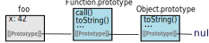

## What is a Prototype ?

A prototype is just an object that is referenced by _other_ objects via an internal property. This allows those other objects access to properties (including functions) which are actually set on the prototype object. The JavaScript spec calls the internal property "`[[Prototype]]` internal slot" [(§ 9.1)](http://www.ecma-international.org/ecma-262/6.0/index.html#sec-ordinary-object-internal-methods-and-internal-slots) and it is _not_ the same thing as the `prototype` property; more on this later. When we say that "`foo` is prototype-linked to `bar`" it means that `foo`'s internal `[[Prototype]]` is a reference to `bar`; therefore, `foo` will have access to `bar`'s properties.

## Default Prototype Links

You probably know that all objects somehow have access to functions like `toString()` and `hasOwnProperty()`, without you having to do anything. This is because all objects have `Object.prototype` in their prototype chain by default, and properties are resolved recursively. If an object doesn't have the property we're trying to access, the prototype chain will be traversed until it is found, or `undefined` is returned. `Object.prototype` is normally the last link in the prototype chain, and it's `[[Prototype]]` is `null`.

```js
const foo = { x: 42 } // by default, foo is prototype-linked to Object.prototype
Object.getPrototypeOf(foo) === Object.prototype // => true
foo.toString() // => '[object Object]' - inherited from Object.prototype
foo.hasOwnProperty('x') // => true
foo.hasOwnProperty('toString') // => false
```


## Creating Prototype Links - Explicitly

There are two other ways of creating prototype links: one is direct (explicit) and the other
one is indirect (implicit). The direct way is by using [`Object.create()`](https://developer.mozilla.org/en-US/docs/Web/JavaScript/Reference/Global_Objects/Object/create).
It will return a new object,
with it's internal `[[Prototype]]` pointing to the object provided as the first parameter. `[[Prototype]]`
can be accessed directly as the `__proto__` property, although it is recommend to use `Object.getPrototypeOf()` instead.
As mentioned before, the `prototype` property is **not** synonymous with `[[Prototype]]`.

```js
const foo = { x: 42 }
const bar = Object.create(foo) // bar is prototype-linked to foo
Object.getPrototypeOf(bar) === foo // => true
bar.__proto__ === foo // => true
bar.x // => 42 - x is actually set on foo, but can be accessed through the prototype chain
bar.toString() // => '[object Object]' - toString() is inherited from Object.prototype
```


### Function Objects

In JavaScript, functions are "first-class objects". This means that we can treat them as any other object - add and remove properties, pass them around as parameters, and so on. It also means that they have `Object.prototype` in their prototype chain; so we can call familiar methods such as `toString()` and `hasOwnProperty()`. But function objects have some extra methods - such as `call()`, `apply()` and `bind()` - because of an extra object in their prototype chain, [`Function.prototype`](https://developer.mozilla.org/en-US/docs/Web/JavaScript/Reference/Global_Objects/Function/prototype). These methods are not set on each function object directly. Instead, each function object holds a reference to the same object, `Function.prototype`, in it's internal `[[Prototype]]` property.

The prototype chain is traversed until a property with the accessed name is found. This means that some properties can end up being "shadowed" by other properties with the same name, but which are set on objects which come first in the prototype chain. `Function.prototype` provides an example, because it defines it's own version of `toString()`, which "shadows" `Object.prototype.toString()`.

```js
function foo() {} // foo is a function object
foo() // invoking the function object; in this case, nothing happens
foo.x = 42 // functions are objects, so we can set props on them
foo.addFive = function (n) { return n + 5 } // adding a function as a prop
foo.toString() // => 'function foo(){}'
foo.toString === Function.prototype.toString // => true
foo.toString === Object.prototype.toString // => false
```

Note how `Function.prototype.toString()` comes before `Object.prototype.toString()`:



## Creating Prototype Links - Implicitly

### The "prototype" property

When a function object is created, JavaScript will add a property to it, `prototype`. This `prototype` is an object with a single (non-internal) property: `constructor` which is a reference back to the function object; more on `constructor` in a bit. For every function object, a new, distinct `prototype` object is automatically instantiated. This object will be the `[[Prototype]]` of objects constructed by the function.

Therefore, function objects have both `[[Prototype]]` and the `prototype` property. It is important to note that they are references to _completely different objects_. The internal `[[Prototype]]` is used when resolving properties on the function object itself, whereas `prototype` will only be used when resolving properties on future objects, constructed by the function object.

```js
function foo() {} // foo is a function object
function bar() {} // bar is a function object
foo.prototype !== bar.prototype // => true
typeof foo.prototype // => "object" (implicitly created by JavaScript)
foo.prototype.x = 42 // linked objects will be able to access 'x'
foo.y = 100 // functions are objects, so we can set props on them; but 'y' will not be inherited
const obj = new foo() // obj is prototype-linked to foo.prototype
obj.x // => 42 - "inherited" from foo.prototype
obj.y // => undefined
```

### The `constructor` Property

We saw that when JS creates a function object, it also creates the prototype object. This object has a "constructor" property, and it is a reference to the function object. Because it's on the prototype, it will be inherited by objects constructed by the function. 

```js
function foo() {}
foo.prototype.constructor === foo // => true
const obj = new foo() // foo will construct an object, linked to `foo.prototype`
obj.constructor === foo // => true - access the 'constructor' through the prototype chain
obj.hasOwnProperty('constructor') // => false - the 'constructor' property is not on 'obj' itself
```

However, it's not safe to assume that if `obj.constructor === foo`, it means the object was created by `foo`. That's because the "prototype" property of function objects can be changed, so `prototype.constructor` can point to anything:

```js
function foo() {}
function bar() {}
foo.prototype = {
  constructor: bar
}
const obj = new foo()
obj.constructor === bar // => true - even though foo created obj
```

### Constructor Functions

In JavaScript, almost **any** function becomes a constructor when called with `new`. As we saw previously, even a function like `function foo () {}` will still return a new object, prototype-linked to `foo.prototype`. The most notable exception consists of arrow functions, which cannot be called with `new`.

Just before executing a constructor call, JavaScript will create a brand new object and it will set `this` to point to it for the duration of the constructor function's execution. It will also set the object's internal `[[Prototype]]` property to point to the function's `prototype`. At the end of the execution, the return value of the function is this newly created object; the class _instance_. JavaScript will automatically set it as the return value. Note that this happens only if a function is called with `new`:

```js
function Foo (initialCount) {
  this.count = initialCount
}
Foo.prototype.incrementCount = function () {
  this.count++
}
const o1 = new Foo(10) // o1: { count: 10 } 
o1.incrementCount()
o1.count // => 11
const o2 = Foo(10) // o2: undefined; possible side-effect: window.count === 10
const o3 = {} // an empty object
Foo.call(o3, 10) // invoke Foo; it will run with o3 as `this`, will not create a new object
o3 // { count: 10 }
```

When we call a function without `new`, it won't implicitly create and return a new object. So what will `this` point to, then ? Because `this` is bound at run-time, it really depends on how the function was called. If a function is not called as the prop of an object, and is not bound (with `bind` or with `call/apply`) then `this` will be the global object. For browsers, that's `window`; hence the unwanted side-effect in the example above. [More details on `this`.](https://github.com/getify/You-Dont-Know-JS/blob/master/this%20%26%20object%20prototypes/ch2.md)

### Constructing Objects and Functions

The `foo = {x: 42}` notation is actually a shorthand for `foo = new Object(); foo.x = 42;`. So, the [`Object`](https://developer.mozilla.org/en-US/docs/Web/JavaScript/Reference/Global_Objects/Object) built-in is used as a constructor. `Object` is itself a function object, so it has `Function.prototype` as it's `[[Prototype]]`, which holds function-specific methods, like `call`; these can be invoked directly on `Object`. But objects constructed by `Object` are not function objects, and have a different `[[Prototype]]` - namely,  `Object.prototype`.

There is also a `Function` built-in, and it is also a function object. It will construct function objects, which will have `Function.prototype` as their `[[Prototype]]`. The constructor form is rarely used because parameters and the function body must be supplied as plain strings: `twice = new Function("x", "return x*2")`. So the shorthand form is normally used: `twice = function(x) { return x*2 }`. The constructed object is `twice`, and it does have access to `Function.prototype` methods.

```js
Object.getPrototypeOf(Object) === Function.prototype // => true
Object.getPrototypeOf(Function) === Function.prototype // => true
Object.getPrototypeOf(Function.prototype) === Object.prototype // => true
let o1 = { foo: 42 } // plain object, constructed by Object
let o2 = function() {} // function object, constructed by Function
```

## Implementing Inheritance with Function Objects

We've seen how the prototype chain can be used to enable objects to delegate functionality to other objects; JavaScript is a dynamic, prototype-based language. We can also use it as a class-based OO language; we've already seen some of the hallmarks - using `new` to create new objects, the `constructor` property. But there are a few more things that happen in class-based languages. One such thing is calling the "parent" constructor; when the sub-class is instantiated, one would expect the super-class constructor to be called. Therefore, we need to make sure to call the parent function, which is also the super-class constructor:

```js
function Bar (initialCount) {
  Foo.call(this, initialCount)
}
```
We also need a way for `Bar` to inherit from `Foo`; this is done via the prototype chain:

```js
Bar.prototype = Object.create(Foo)
```

Why not just `Bar.prototype = Foo.prototype` ? Because then the "prototype" property of both function objects would reference the exact same object. If you add something to `Bar`'s prototype, it would also be inherited by all `Foo` instances. This is not desirable because super classes should not inherit from their sub-classes.

We could also try `Bar.prototype = new Foo()`; this would also make inheritance happen. However, this can have unwanted side-effects. Let's say we create a `Foo` instance when the user clicks a button, and we log that action in the `Foo` function. However, if we check the logs, we will see that we always get an entry without the user doing anything - it's because we run the `Foo` function to setup `Bar`'s prototype.

## Shadowing/Overriding

In most cases, creating a property on an object will succeed. If the objects happens to be used as a prototype, properties created on it will "shadow" properties with the same name further down the prototype chain. But there are two situations in which that will not happen, at least not as expected.

### Situation 1 - The Property is a [setter](https://developer.mozilla.org/en-US/docs/Web/JavaScript/Reference/Functions/set)

In JS, if we want to run a function when setting a property, we can can use a setter. If we're trying to set a property on an object, and another object in the prototype chain has a property with the same name that is a setter, **JS will call the setter**. The setter function can use `this`, which will be a reference to the target object, _not_ the linked object:

```js
const foo = {
  set myProp(value) {
    // this function will be called when trying to set 'myProp' on:
    //   1. foo itself
    //   2. objects which have foo in their prototype chain.
    this.x = value + 1
    // this.myProp = value + 1 // DON'T DO THIS - generates an infinite loop !
  }
}
const bar = Object.create(foo) // 'bar' is the target object
bar.myProp = 10 // the setter will be called with 10 as a parameter; `this` will be 'bar'
bar.myProp // => undefined - the setter didn't create a 'myProp' property, it created an 'x' property
bar.x // => 11
```

### Situation 2 - The Property is Read-only

We can create read-only properties using [Object.defineProperty](https://developer.mozilla.org/en-US/docs/Web/JavaScript/Reference/Global_Objects/Object/defineProperty):
```js
const foo = {}
Object.defineProperty(foo, 'myProp', {
  value: 42,
  writable: false,
})
foo.myProp // => 42
foo.myProp = 100 // ignored, or throws in "strict" mode
foo.myProp // => 42
```
If `foo` is part of the prototype chain for `bar`, then we **can't set a "myProp" property on `bar`**. In other words, a read-only prop somewhere down the line in the prototype chain will prevent assigning a property with that name on the target object. In `strict` mode, an exception will be thrown; otherwise the assignment will just silently fail.

```js
// continuing previous example
const bar = Object.create(foo)
bar.myProp = 100 // nothing happens !
bar.myProp // => 42
```
Essentially, it means that if an object has a 'myProp' property that is read-only, then it can't be _shadowed_ by objects which will add this object to their prototype chain. But, if the property is writable, you're free to shadow it !

```js
const foo = {}
Object.defineProperties(foo, {
  'myReadOnlyProp': { value: 42, writable: false },
  'myWritableProp': { value: 10, writable: true }
})
const bar = Object.create(foo)
bar.myReadOnlyProp = 100 // can't shadow read-only props, nothing happens
bar.myReadOnlyProp // => 42
bar.myWritableProp = 100 // can shadow writable props; prop created on `bar`
foo.myWritableProp // => 10; the shadowed property is unaffected
bar.myWritableProp // => 100
```

## Summary

JS automatically adds a "prototype" property to function objects. When we instantiate objects by calling the function as a constructor (with `new`), the created objects will have access to properties on the `prototype` object. One such property is the `constructor` property, added by JS and which normally points to the function. We can create prototype-linked objects directly, with `Object.create`.

An object's `prototype` property is **not** the same as it's internal `[[Prototype]]` link; if the object is a function, then it's `prototype` will become the `[[Prototype]]` of objects created when that function is called as a constructor. We can use `__proto__` or `Object.getPrototypeOf` to get a reference to the object referenced by the internal `[[Prototype]]` slot, and we can use either `__proto__` or `Object.setPrototypeOf` to set it's value.

Reading the value of a property that is not on the target object will traverse the prototype chain and return the first one found, or `undefined`, whereas the algorithm for setting such properties is more complex, calling the first found setter and preventing the shadowing of read-only properties.

## Resources

- [You Don't Know JS: this & Object Prototypes](https://www.ebooks.com/1734321/you-don-t-know-js-this-object-prototypes/simpson-kyle/) ([github](https://github.com/getify/You-Dont-Know-JS/blob/master/this%20&%20object%20prototypes/README.md#you-dont-know-js-this--object-prototypes)) (The YDKJS series is the best resource for learning JS in-depth)
- [Object-oriented programming](https://en.wikipedia.org/wiki/Object-oriented_programming)
- [Prototype-based programming](https://en.wikipedia.org/wiki/Prototype-based_programming)
- [Class-based programming](https://en.wikipedia.org/wiki/Class-based_programming)
