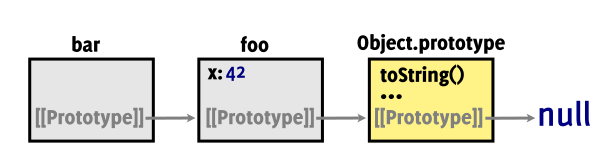
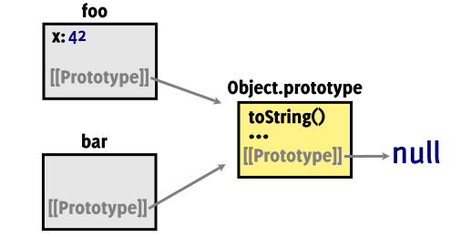
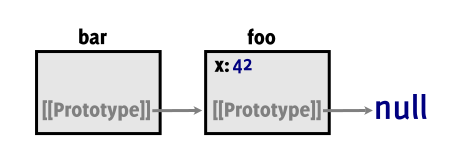
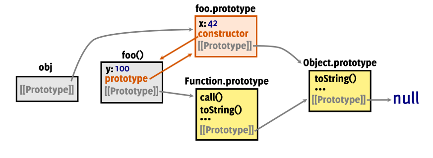

### What is a Prototype ?

Many programming languages support associating behaviour (a set of methods) with objects. For example, if creating some sort of graphical user interface which includes a number of buttons, you don't want to manually associate each method with each object that represents a button. Instead, you expect the language to provide you with a way of creating objects that work as buttons, so that the "button" behaviour is _shared_ between all button objects.

The prototype mechanism is at the core of how this is done in JavaScript. You take all the shared methods and set them as properties on an object; the resulting object is called a prototype object. You then create other objects and "link" them to the prototype object. This way, the objects can share the same prototype object and have access to all the functionality and data on it - in addition to their own properties. So button objects would store properties specific to each button as _own_ properties (stuff like the text label, or the click handler) whereas shared functionality - like rendering - would be _delegated_ to properties on the prototype object.

Above we describe [prototype-based programming](https://en.wikipedia.org/wiki/Prototype-based_programming), but generally object-oriented programming is associated with a similar, but different paradigm - namely, [class-based programming](https://en.wikipedia.org/wiki/Class-based_programming). JavaScript supports both, but the important thing to keep in mind is that classes are also implemented via the prototype mechanism. So to understand classes, first we must understand prototypes.

### Prototype References

So how does an object reference its prototype ? You'd think it's just a property named "prototype" - but you'd be wrong. While you can _can_ have such a property, generally it wouldn't get any special treatment - it's just like any other property. The _real_ prototype is referenced via an "internal slot", as [the spec calls it](https://www.ecma-international.org/ecma-262/10.0/#sec-object-internal-methods-and-internal-slots); we'll call it a _hidden_ property - meaning it can't be directly accessed, like a "normal" property. Every object has a few of these hidden properties, and the one used to reference the objects prototype is called [`[[Prototype]]`](https://www.ecma-international.org/ecma-262/10.0/#sec-ordinary-object-internal-methods-and-internal-slots).

To confuse matters even more, the "prototype" property does get some special treatment every time a function is invoked as a constructor, and the function happens to have a property with that particular name. This will be discussed later - first let's understand exactly how this fancy `[[Prototype]]` is being used.

### Property Resolution and The Prototype Chain

If you try to access a property which an object doesn't have, the Javascript engine will check if the object references another object via its `[[Prototype]]`, and if it does, the property is searched on the referenced object. The prototype object can have a `[[Prototype]]` of its own, so a property lookup will continue recursively until either the property is found, or one of the prototype objects has `null` as the value of _its_ `[[Prototype]]`.

If `null` is reached without the property being found, then the `undefined` value is given as the result of the property lookup - without actually creating the property and setting it to `undefined`. The sequence of objects traversed in this manner form a [singly linked list](https://en.wikipedia.org/wiki/Linked_list#Singly_linked_list) known as the "prototype chain" of the initial object.

The properties that are set on the object itself are known as the objects _own_ properties, while those accessed through the prototype chain are known as _shared_ or _inherited_.

### Default Prototype Links

Before the Javascript engine starts executing any scripts, it pre-populates the environment with some useful objects, known as "built-ins" or "intrinsics". One such built-in is `Object`, and it references another built-in object via it's "prototype" property; this other object is commonly referred to as `Object.prototype`. We will talk about `Object` later, but for now we only care about `Object.prototype` because it can be found in the prototype chain of virtually all objects as the last link. In the diagrams that follow, built-in objects have a yellow background.

If a prototype object is not specified when an object is created, the object will be linked to `Object.prototype`. In the case of objects created using the literal notation (like `foo` in the snippet below), the prototype chain will be composed of only one object, `Object.prototype`, because the `[[Prototype]]` of `Object.prototype` is `null`. We'll call this type of objects, with only `Object.prototype` in their prototype chain, "plain" objects.

So how can we verify that the prototype links are setup as intended ? Although `[[Prototype]]` is an internal property, we can get a reference to the underlying object by using [`Object.getPrototypeOf()`](https://developer.mozilla.org/en-US/docs/Web/JavaScript/Reference/Global_Objects/Object/getPrototypeOf). We could also use the [`__proto__`](https://developer.mozilla.org/en-US/docs/Web/JavaScript/Reference/Global_Objects/Object/proto) property, but it is only guaranteed to be available in browser environments for backwards-compatibility reasons, and is considered deprecated.

Below, `foo` has an own property, "x", and a number of shared properties - all the properties on `Object.prototype` (like `hasOwnProperty()`, `toString()`, etc). Note that it doesn't matter what type the shared properties have - strings, functions, objects, etc - they are all shared in exactly the same way.

```js
let foo = { x: 42 }; // foo is prototype-linked to Object.prototype by default
Object.getPrototypeOf(foo) === Object.prototype; // => true - same exact object
Object.getPrototypeOf(Object.prototype) === null; // => true
foo.toString(); // => '[object Object]' - toString() is defined on Object.prototype
foo.hasOwnProperty('x'); // => true
foo.hasOwnProperty('toString'); // => false
Object.prototype.x; // undefined - prototype links go only one way
```


### Creating Explicit Prototype Links

What if you want to create objects linked to a specific object, instead of `Object.prototype`?
This can be achieved using [`Object.create()`](https://developer.mozilla.org/en-US/docs/Web/JavaScript/Reference/Global_Objects/Object/create). It will return a new object, with it's internal `[[Prototype]]` pointing to the object provided as the first parameter. The created objects will have access to the prototype objects' properties.

In most cases, setting a custom prototype doesn't mean the resulting object looses access to properties on `Object.prototype` - because the object that is supplied as a prototype probably has a prototype chain itself, that includes `Object.prototype`.

```js
let foo = { x: 42 };
let bar = Object.create(foo); // bar is created linked to foo
Object.getPrototypeOf(bar) === foo; // => true
bar.x; // => 42 - x is actually set on foo, but can be accessed through the prototype chain
bar.toString(); // => '[object Object]' - toString() from Object.prototype
let empty = Object.create(null); // create an empty object
Object.getPrototypeOf(empty) === true; // => true
```



What about changing the `[[Prototype]]` of objects that were already created? [`Object.setPrototypeOf()`](https://developer.mozilla.org/en-US/docs/Web/JavaScript/Reference/Global_Objects/Object/setPrototypeOf) has you covered; it takes two objects as parameters, and will set the `[[Prototype]]` of the first object to point to the second one. And since we're dealing with prototype chains containing more than one object, let's introduce another useful function: [`Object.prototype.isPrototypeOf()`](https://developer.mozilla.org/en-US/docs/Web/JavaScript/Reference/Global_Objects/Object/isPrototypeOf). Because it is an own property of `Object.prototype`, like `toString()`, `isPrototypeOf()` can be invoked as a property of virtually any object and returns `true` if the object it is called on can be found in the prototype chain of the object given as a parameter.

```js
let foo = { x: 42 }; // foo is linked to Object.prototype
let bar = {}; // bar is linked to Object.prototype
bar.x; // => undefined
foo.isPrototypeOf(bar); // => false - foo is not in the prototype chain of bar
```


```js
Object.setPrototypeOf(bar, foo); // change the [[Prototype]] of bar to reference foo
Object.getPrototypeOf(bar) === foo; // => true - bar is linked to foo
foo.isPrototypeOf(bar); // => true - foo is in the prototype chain of bar
Object.prototype.isPrototypeOf(bar); // => true
Object.prototype.isPrototypeOf(foo); // => true
bar.x; // => 42
bar.toString(); // => '[object Object]'
```


If a completely empty object is desired, with no properties whatsoever - either own or shared - it can be created with `Object.create(null)`. Existing objects can be "stripped" of their prototype chains with `Object.setPrototypeOf(obj, null)` - but they will keep their own properties. Such objects will not have access to any functions through the prototype chain - not even basic object functions like `toString()` and `hasOwnProperty()`. If a "stripped" object is used as a prototype, then any objects that link to it will also lose access to these functions. In the snippet below, because we change the `[[Prototype]]` of `foo`, `bar` looses access to functions on `Object.prototype` - even though `bar` itself is unchanged.

```js
let foo = { x: 42 }; // foo is linked to Object.prototype
let bar = Object.create(foo); // bar is linked to foo
bar.toString(); // => "[object Object]" - invokes Object.prototype.toString()
Object.setPrototypeOf(foo, null); // foo looses its prototype chain; own properties not affected
foo.toString(); // => throws an exception
bar.toString(); // => throws an exception - lost access to toString() because foo was changed
bar.x; // => 42
```


#### Function Objects

Functions are "first-class objects"; essentially it means that we can treat them as any other object - add and remove properties, pass them around as parameters, and so on. It also means that they have `Object.prototype` in their prototype chain, so function objects can invoke familiar methods such as `toString()` and `hasOwnProperty()`. But they can access some additional methods, such as `call()`, `apply()` and `bind()`. This is because they have another built-in object, [`Function.prototype`](https://developer.mozilla.org/en-US/docs/Web/JavaScript/Reference/Global_Objects/Function/prototype), as their `[[Prototype]]` - which, in turn, has `Object.prototype` as it's `[[Prototype]]`.

The code snippet and diagram below demonstrate the relationship between a function object, `Function.prototype` and `Object.prototype`. The function object has a prototype chain composed of two objects, thus  having access to properties on both. Note that the properties on `Function.prototype` and `Object.prototype` are never copied over to the function objects; they remain set on the prototype objects, and are accessed indirectly - through the prototype chain.

In addition, in the example below you can see what happens when multiple objects in the prototype chain have a property with the same name. Put simply, the first property to be reached, is the one that will be used; this is called _shadowing_, because the first found property "shadows" any properties withe same name that are set on "downstream" objects in the prototype chain. `Function.prototype` provides an example, because it defines it's own version of `toString()`, which shadows `Object.prototype.toString()`.

```js
function foo() {}; // foo is a function object; by default, functions return the `undefined` value
foo(); // => undefined - invoking the function object 
foo.x = 42; // functions are objects, so we can add properties
foo.toString(); // => 'function foo(){}'
foo.toString === Function.prototype.toString; // => true
foo.toString === Object.prototype.toString; // => false
```


#### Shadowing Read-Only Properties

Normally when setting a new property on an object, the property is created on the object itself - objects in its prototype chain are not involved or affected. If one of the prototype objects has a property with the same name, it won't be overwritten - it will be shadowed. That being said, the engine will not allow you to shadow read-only properties - attempting to do so will result in a silent failure in sloppy mode, and a `TypeError` exception in strict mode.

Read-only properties can be created with [`Object.defineProperty()`](https://developer.mozilla.org/en-US/docs/Web/JavaScript/Reference/Global_Objects/Object/defineProperty) - and this same function can also be used to get around the "no shadowing read-only properties" rule. It is quite unfortunate that the language is not consistent in this regard, and only enforces the rule in certain situations; one way to "rationalize" this is to simply think of `defineProperty()` as the [`sudo`](https://www.xkcd.com/149/) way of setting properties, to be used when you don't care about (or rather, you _considered_) the consequences.

The `foo.x` property in the snippet below is read-only, and it is annotated in the diagram using a gray lock symbol. Note that even though the read-only property is set on `foo`, it will prevent you from creating a property with the same name on `bar`, because then you would shadow a read-only property.

```js
let foo = {};
Object.defineProperty(foo, "x", { writable: false, value: 42 }); // foo.x is 42 and is read-only
Object.defineProperty(foo, "y", { writable: true, value: 42 }); // equivalent to `foo.y = 42`
foo.x = 100; // does nothing, because x is not writable (i.e., it's read-only)
foo.y = 100; // works as expected
let bar = Object.create(foo);
bar.x = 100; // does nothing, because a prototype has a read-only property with the same name
bar.y = 100; // works as expected - creates a property on bar
// Object.defineProperty(bar, "x", { value: 100 }); // this would actually set `x` to `100`
```


#### Shadowing `set` Accessors

Another potentially confusing situation occurs when a property is defined using a [setter function](https://developer.mozilla.org/en-US/docs/Web/JavaScript/Reference/Functions/set). This language feature allows defining a function which will be called every time a property is set; getters are also supported and will be called when "reading" the property's value. This type of accessors (defined with the `get` and `set` keywords) are not very common in application code and are mostly found in libraries - [`Vue.js`](https://vuejs.org/v2/guide/reactivity.html), for example, uses them to implement it's reactivity model. Instead, getters and setters are generally implemented using regular functions - perhaps because explicit function invocations express the intent more clearly, or because additional parameters cannot be supplied when using `get` and `set` functions.

If trying to set a property on an object, and another object in the prototype chain has a property with the same name that is a setter, **the setter will be called**, rather than the property being set. The setter function can use `this`, which will be a reference to the original object, _not_ the prototype object, and a property _might_ end up being set as a result of the setter function executing - but it can't have the same name as the setter property because that would generate an infinite loop.

```js
const foo = {
  set myProp(value) {
    // this function will be called when trying to set 'myProp' on:
    //   1. foo itself
    //   2. objects which have foo in their prototype chain.
    this.x = value + 1
    // this.myProp = value + 1 // 💥 generates an infinite loop
  }
}
const bar = Object.create(foo)
foo.myProp = 10 // the setter will be called; `this` will be `foo`
bar.myProp = 10 // the setter will be called; `this` will be `bar`
bar.myProp // => undefined - the setter didn't create a 'myProp' property, it created an 'x' property
bar.x // => 11
```


### Creating Implicit Prototype Links

#### The `prototype` and `constructor` Properties

When the JavaScript engine creates a function object, it automatically creates another object, which will be accessible through the `prototype` property of the function object. Each function gets its own `prototype` object. The `prototype` object will be used when (and if) the function is invoked as a constructor - more on this in a bit. The important thing to note for now is that this "automagically" created object is not empty - instead, it has a `constructor` property - which is a reference back to the function object. It also has a `[[Prototype]]` link to `Object.prototype`, because it's a regular object. So, the function object and the `prototype` object have references to each other via the `prototype` and `constructor` properties.

Function objects have both a `[[Prototype]]` "internal slot" _and_ a `prototype` property. It is important to note that they are references to _completely different objects_, used for different purposes. The internal `[[Prototype]]` is used when resolving properties on the function object itself, whereas `prototype` will only be used when resolving properties on (potential) future objects, constructed by the function object. Properties set on the function object itself - as opposed to it's `prototype` property - will _not_ be accessible through the prototype chain of the constructed objects. I find it helpful to think of `[[Prototype]]` as the _real_ or _concrete_ prototype, and the "prototype" property as "maybe-prototype" or "prototype-wannabe".

```js
function foo() {} // foo is a function object
foo.prototype.constructor === foo // => true
Object.getPrototypeOf(foo) === Function.prototype // => true
```

In the following diagrams, objects and properties created implicitly are coloured with orange.


#### Functions as Constructors

Almost **any** function becomes a constructor when invoked with `new`. Generally, it is determined at run-time whether a function is run as a constructor or as a regular function because the same function can be executed in either way. Notable exceptions include [arrow functions](https://developer.mozilla.org/en-US/docs/Web/JavaScript/Reference/Functions/Arrow_functions), which cannot be called with `new`, and `class` functions, which cannot be called _without_ `new`; in both cases, attempting to do so will result in an exception being thrown - even in non-strict mode.

The most important thing that happens when a function is invoked as a constructor, is that the returned object (the _instance_) will, by default, be prototype-linked to the object referenced by the function's `prototype` property.

```js
function foo() {} // just a regular, empty function
foo.prototype.x = 42 // linked objects will be able to access 'x'
foo.y = 100 // functions are objects, so we can set props on them; but 'y' will not be inherited
let obj = new foo() // obj is prototype-linked to foo.prototype (but not to foo itself!)
obj.constructor === foo // => true - 'constructor' is accessed through the prototype chain
obj.hasOwnProperty("constructor") // => false - the 'constructor' property is not on 'obj' itself
obj.hasOwnProperty("x") // => false - 'obj' has no such property
obj.x // => 42 - this is "x" from foo.prototype, inherited via the prototype chain
obj.y // => undefined - only properties on the function's 'prototype' are accessible by linked objects
```


##### Return Value

Every time a function is invoked as a constructor, the JavaScript engine will preemptively create the instance object and make `this` point to it, so that it's already available _before_ the function body actually starts executing. It will be an empty object which, as mentioned, will be prototype-linked to the object referenced by the constructor function's `prototype` property. When the constructor invocation finishes executing, the `this` object is the implicit return value. A different object can be specified with a `return` statement; but it has to be an object - JavaScript will silently ignore requests to return primitives from constructor invocations, and return the instance.

```js
function foo(initialZ) { this.z = initialZ }
foo.prototype.x = 42
foo.y = 100
function bar() { return 500 }
let result1 = new foo(1) // => { z: 1 } - create one instance
result1.y // => undefined
result1.x // => 42
let result2 = new foo(2) // => { z: 2 } - create another instance
let result3 = new bar() // result3 is an empty object linked to bar.prototype - the `this` object
let result4 = bar() // result4 is a number, 500 - non-constructor invocations can return anything
```


##### Let's Break Things

Note in the diagram above that the constructed objects aren't _directly_ associated with the function that created them; the connection goes through an intermediate prototype object. These links could also be called "fragile", because
it's not safe to assume that the function object referenced by an object's `constructor` property is the function object that actually created the object, because a functions `constructor` property is not protected in any way and can be changed to point to something else - either on purpose, or by mistake.


```js
function foo() {}
foo.prototype.constructor === foo // => true
foo.prototype.constructor = "bad idea" // changing the constructor property directly
let obj = new foo() // create an instance
obj.constructor === "bad idea" // => true - instance's "constructor" is misleading
```


There are a couple of other ways we could "break" `constructor` - by shadowing it with an own property, or by removing it from the prototype with the [`delete`](https://developer.mozilla.org/en-US/docs/Web/JavaScript/Reference/Operators/delete) operator. Of course, this should be avoided; the point of this section is just to illustrate that doing so is not illegal in JavaScript, as it would be in other object-oriented languages.

#### Functions as Methods

We've seen how a function object can put on its "constructor" hat when invoked with `new`. As it turns out, most JavaScript functions have one more hat at their disposal - the "method" hat. When a function is invoked as a property of an object, it is said to have been invoked as a "method", and the object it is invoked on is known as the "target" object. During a method invocation, the target object will be available as `this`.

Methods are a common feature of most OO languages, where a method is a special kind of function, reserved for instances of a specific class and classes that inherit from it. Because an objects' class generally cannot be changed, the complete set of available methods on any given object is known as soon as it's created - which allows for features like IDE auto-completion and static analysis. In JavaScript, things are a bit different; any object can use most functions as a method - as long as it can reference the function as an own property. Not even the basic set of object methods found on `Object.prototype` are guaranteed to be available, because an object can have a `null` prototype. Also, as we've seen, the prototype chain can be modified at runtime - therefore, the set of available methods can also vary over time.

After executing the snippet below, `obj1` and `obj2` each have an _own_ property referencing a function object, which they can invoke as a method. But, both properties reference the exact same function object, which isn't really _owned_ by any of them. By simply referencing a function object via a property, objects can "pick and choose" their methods - including methods of other objects !

```js
function doubleMyX() { this.x = this.x * 2 }
let obj1 = { x: 10, double: doubleMyX } // initialize obj1 with two properties
obj1.double() // invoke a function as a method of obj1
obj1.x // => 20
let obj2 = { x: 100 } // obj2 is just a plain object
obj2.toString() // a function from the prototype chain invoked as a method
obj2.secondDouble = obj1.double // obj2.secondDouble references the same object as obj1.double
obj2.secondDouble() // same function referenced by obj1.double, invoked as a method of obj2
obj2.x // => 200
```


#### Functions as... Functions

Of course, functions can be invoked as plain functions; the only question is how will `this` references be resolved, if existing. Generally if a function contains `this` references, it should only be invoked as a constructor, or as a method. What happens if such a function is invoked as a plain function (and without [`call()`](https://developer.mozilla.org/en-US/docs/Web/JavaScript/Reference/Global_Objects/Function/call)/[`apply()`](https://developer.mozilla.org/en-US/docs/Web/JavaScript/Reference/Global_Objects/Function/apply) or [`bind()`](https://developer.mozilla.org/en-US/docs/Web/JavaScript/Reference/Global_Objects/Function/bind)) depends on "strictness" - in strict mode, `this` will be the `undefined` value. In non-strict, `this` will reference the global object - so the function will run without complaining, but might have unwanted side effects. A detailed coverage of how `this` works can be found in [YDKJS/this & Object Prototypes](https://github.com/getify/You-Dont-Know-JS/blob/1st-ed/this%20%26%20object%20prototypes/ch2.md).

#### The `instanceof` Operator

In another nod to class-based <abbr title="Object Oriented Programming">OOP</abbr>, JavaScript provides us with the [`instanceof`](https://developer.mozilla.org/en-US/docs/Web/JavaScript/Reference/Operators/instanceof) operator. It is a binary operator which expects an object as the <abbr title="left-hand side">LHS</abbr>, and a function as the <abbr title="right-hand side">RHS</abbr>. It iterates over the objects prototype chain, and checks whether any of the encountered objects is the same as the object referenced by the function's `prototype`.

In the snippet below, `obj`s prototype chain includes two objects, `foo.prototype` and `Object.prototype`, so it will be an instance of `foo` and `Object`. For clarity, we're also including the `Object` and `Function` built-ins in the diagram; so far we've omitted them to keep the diagrams simple.

```js
function foo() {} // just a regular, empty function
foo instanceof Function // => true; Function.prototype is in foo's prototype chain
foo instanceof Object // => true; Object.prototype is in foo's prototype chain
let obj = new foo() // obj is prototype-linked to foo.prototype
obj instanceof foo // => true; foo.prototype is in obj1's prototype chain
obj instanceof Object // => true; Object.prototype is in obj1's prototype chain
obj instanceof Function // => false; Function.prototype is not in obj1's prototype chain
```


Much like the `constructor` property on an object, the `instanceof` operator also can be "broken" because the `prototype` property of a function can be changed - although, unlike `constructor`, it cannot be removed. If we change `foo.prototype` to point to a different object, the `instanceof` operator will no longer recognize `obj` as an "instance of" `foo()`.

```js
// ...
foo.prototype = { x: 42 }
obj instanceof foo // => false
obj.x // => undefined
let obj2 = new foo() // construct an object once the prototype was changed
obj2.x // => 42
obj2 instanceof foo // => true
obj2.constructor === foo // => false
obj2.constructor === Object // => true
Object.getPrototypeOf(obj2) === Object.getPrototypeOf(obj) // => false
```


## Summary

JS automatically adds a "prototype" property to function objects. When we instantiate objects by calling the function as a constructor (with `new`), the created objects will have access to properties on the `prototype` object. One such property is the `constructor` property, added by JS and which normally points to the function. We can create prototype-linked objects directly, with `Object.create`.

An object's `prototype` property is **not** the same as it's internal `[[Prototype]]` link; if the object is a function, then it's `prototype` will become the `[[Prototype]]` of objects created when that function is called as a constructor. The `Object.getPrototypeOf()` function can be used to get a reference to `[[Prototype]]`, and `Object.setPrototypeOf()` can be used to change it.

Reading the value of a property that is not on the target object will traverse the prototype chain and return the first one found, or `undefined`, whereas the algorithm for setting such properties is more complex, calling the first found setter and preventing the shadowing of read-only properties.

Care needs to be exercised if relying on OOP features like the `constructor` property or the `instanceof` operator as they can be misleading. Some of these issues are addressed by using `class` keyword, to be examined in detail in a future article.

## Resources

- [You Don't Know JS: this & Object Prototypes](https://www.ebooks.com/1734321/you-don-t-know-js-this-object-prototypes/simpson-kyle/) ([github](https://github.com/getify/You-Dont-Know-JS/blob/master/this%20&%20object%20prototypes/README.md#you-dont-know-js-this--object-prototypes)) (The YDKJS series is an excellent resource for learning JS in-depth)
- [Object-oriented programming](https://en.wikipedia.org/wiki/Object-oriented_programming)
- [Prototype-based programming](https://en.wikipedia.org/wiki/Prototype-based_programming)
- [Class-based programming](https://en.wikipedia.org/wiki/Class-based_programming)